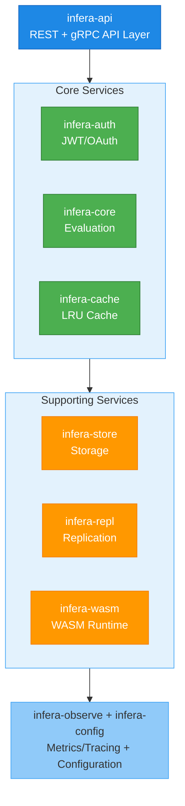

# InferaDB

**A high-performance authorization engine implementing Relationship-Based Access Control (ReBAC) in Rust.**

InferaDB delivers millisecond-scale authorization decisions at global scale through distributed inference, intelligent caching, and a powerful policy language.

## What Makes InferaDB Special?

- **Blazing Fast**: Sub-10ms authorization checks with intelligent caching
- **Complete API Surface**: Check, Expand, ListResources, ListSubjects, ListRelationships, Watch
- **Multi-Tenant**: Complete data isolation using Accounts and Vaults
- **Wildcard Support**: Model public resources with `user:*` pattern (Phase 3.1)
- **Real-time Updates**: Watch API streams relationship changes via gRPC/SSE (Phase 2.2)
- **Global Scale**: Multi-region replication with active-active deployment
- **Production Ready**: JWT/OAuth authentication, graceful shutdown, health checks
- **Observable**: Prometheus metrics, OpenTelemetry tracing, structured logging
- **ReBAC Native**: First-class relationship traversal and computed usersets
- **Flexible Storage**: Memory backend for dev, FoundationDB for production
- **Extensible**: WASM modules for custom authorization logic

## Quick Start

### Prerequisites

- [Mise](https://mise.jdx.dev/)
- Rust 1.83+

### Get Running in 60 Seconds

```bash
# Clone and setup
git clone https://github.com/inferadb/server inferadb
cd inferadb

# Trust configuration and install dependencies
mise trust && mise install

# Start the server
mise run dev

# Server now running at http://localhost:8080
```

### Make Your First Authorization Check

```bash
curl -X POST http://localhost:8080/v1/evaluate \
  -H "Content-Type: application/json" \
  -d '{
    "evaluations": [
      {
        "subject": "user:alice",
        "resource": "doc:readme",
        "permission": "viewer"
      }
    ]
  }'

# Response: {"results": [{"decision": "allow"}]}
```

### Model Public Resources with Wildcards

InferaDB supports wildcard subjects to model public access:

```bash
# Write a wildcard relationship - all users can view
curl -X POST http://localhost:8080/v1/relationships/write \
  -H "Content-Type: application/json" \
  -d '{
    "relationships": [{
      "resource": "doc:announcement",
      "relation": "viewer",
      "subject": "user:*"
    }]
  }'

# Any user will be allowed
curl -X POST http://localhost:8080/v1/evaluate \
  -H "Content-Type: application/json" \
  -d '{
    "evaluations": [
      {
        "subject": "user:alice",
        "resource": "doc:announcement",
        "permission": "viewer"
      }
    ]
  }'
# Response: {"results": [{"decision": "allow"}]}
```

**→ Continue with the [Quick Start Guide](docs/quickstart.md) for a complete walkthrough**

## Architecture

InferaDB is built as a modular Rust workspace:



**Core Crates:**

- **infera-core** - Policy evaluation engine and IPL interpreter
- **infera-store** - Storage abstraction (Memory, FoundationDB)
- **infera-api** - REST and gRPC APIs with authentication
- **infera-auth** - JWT/OAuth validation, JWKS caching
- **infera-cache** - Intelligent authorization result caching
- **infera-repl** - Multi-region replication with conflict resolution
- **infera-wasm** - WebAssembly policy module runtime
- **infera-observe** - Metrics, tracing, and logging
- **infera-config** - Configuration management

**→ Learn more in the [Architecture Overview](docs/architecture.md)**

## Development Commands

```bash
# One-time setup (installs Rust, cargo tools, etc.)
mise trust && mise install

# Daily development (standard cargo commands)
cargo test                              # Run tests
cargo build                             # Build debug binary
cargo build --release                   # Build release binary
cargo clippy --workspace -- -D warnings # Lint code
cargo fmt                               # Format code

# Or use Make for convenience
make help        # Show all available commands
make test        # Run all tests
make check       # Run all quality checks (fmt + clippy + test + audit)
make dev         # Start dev server with auto-reload
make ci          # Simulate CI checks locally
```

**→ See [Building from Source](docs/guides/building.md) for detailed setup**

## Configuration

Configure InferaDB using any combination of:

1. **Configuration file** (`config.yaml`)
2. **Environment variables** (`INFERADB__SERVER__PORT=8080`)
3. **Command-line arguments** (`--port 8080`)

**Example Production Configuration:**

```yaml
server:
  host: "0.0.0.0"
  port: 8080
  worker_threads: 8

store:
  backend: "foundationdb"
  connection_string: "/etc/foundationdb/fdb.cluster"

cache:
  enabled: true
  max_capacity: 100000
  ttl_seconds: 300

auth:
  enabled: true
  jwks_base_url: "https://your-domain.com/jwks"
  replay_protection: true
  redis_url: "redis://redis:6379"
```

**→ Complete reference: [Configuration Guide](docs/guides/configuration.md)**

## Authentication Setup

InferaDB integrates with the **InferaDB Management API** for authentication. The management API is the source of truth for all authentication mechanisms - it handles user registration, organization management, and issues JWT tokens that the server validates.

### Quick Setup

1. **Start the Management API** (required for authentication):

   ```bash
   # In your management API directory
   cd management
   make run
   # Management API runs on http://localhost:8081
   ```

2. **Configure Server** to point to management API:

   ```yaml
   # config.yaml
   auth:
     enabled: true
     management_api_url: "http://localhost:8081"
     management_api_timeout_ms: 5000
     management_cache_ttl_seconds: 300
     cert_cache_ttl_seconds: 900
     management_verify_vault_ownership: true
     management_verify_org_status: true
   ```

3. **Register and Create Credentials** via management API:

   ```bash
   # Register user and create organization
   curl -X POST http://localhost:8081/v1/auth/register \
     -H "Content-Type: application/json" \
     -d '{"name": "Alice", "email": "alice@example.com", "password": "SecurePassword123!", "accept_tos": true}'

   # Login to get session
   curl -X POST http://localhost:8081/v1/auth/login \
     -H "Content-Type: application/json" \
     -d '{"email": "alice@example.com", "password": "SecurePassword123!"}'
   # Returns: {"session_id": "sess_...", "user_id": "..."}

   # Create a vault (using session from login)
   curl -X POST http://localhost:8081/v1/vaults \
     -H "Authorization: Bearer <session_id>" \
     -H "Content-Type: application/json" \
     -d '{"name": "My App Vault", "organization_id": "<org_id>"}'
   # Returns: {"id": "<vault_id>", ...}

   # Create client credentials
   curl -X POST http://localhost:8081/v1/organizations/<org_id>/clients \
     -H "Authorization: Bearer <session_id>" \
     -H "Content-Type: application/json" \
     -d '{"name": "Production Service"}'
   # Returns: {"id": "<client_id>", ...}

   # Create Ed25519 certificate
   # First, generate a key pair (example in Python):
   # from cryptography.hazmat.primitives.asymmetric import ed25519
   # private_key = ed25519.Ed25519PrivateKey.generate()
   # public_key_bytes = private_key.public_key().public_bytes_raw()
   # public_key_b64 = base64.b64encode(public_key_bytes).decode()

   curl -X POST http://localhost:8081/v1/organizations/<org_id>/clients/<client_id>/certificates \
     -H "Authorization: Bearer <session_id>" \
     -H "Content-Type: application/json" \
     -d '{"name": "Prod Cert", "public_key": "<base64_public_key>"}'
   # Returns: {"id": "<cert_id>", "kid": "org-xxx-client-yyy-cert-zzz", ...}
   ```

4. **Generate JWT** and call the server:

   ```python
   import jwt
   import datetime
   from cryptography.hazmat.primitives import serialization
   from cryptography.hazmat.primitives.asymmetric import ed25519

   # Load your private key
   private_key = ed25519.Ed25519PrivateKey.from_private_bytes(...)

   # Create JWT claims
   claims = {
       "iss": "http://localhost:8081/v1",
       "sub": f"client:{client_id}",
       "aud": "http://localhost:8080",
       "exp": datetime.datetime.now(datetime.timezone.utc) + datetime.timedelta(minutes=5),
       "iat": datetime.datetime.now(datetime.timezone.utc),
       "jti": str(uuid.uuid4()),
       "vault": vault_id,
       "account": account_id,
       "scope": "read write"
   }

   # Sign JWT with Ed25519 private key
   token = jwt.encode(
       claims,
       private_key,
       algorithm="EdDSA",
       headers={"kid": kid}  # From certificate creation response
   )

   # Use token with server
   response = requests.post(
       "http://localhost:8080/v1/evaluate",
       headers={"Authorization": f"Bearer {token}"},
       json={"object": "document:1", "relation": "viewer", "subject": "user:alice"}
   )
   ```

### Environment Variables

Configure authentication via environment variables:

```bash
export INFERADB__AUTH__ENABLED=true
export INFERADB__AUTH__MANAGEMENT_API_URL=http://localhost:8081
export INFERADB__AUTH__MANAGEMENT_API_TIMEOUT_MS=5000
export INFERADB__AUTH__MANAGEMENT_CACHE_TTL_SECONDS=300
export INFERADB__AUTH__CERT_CACHE_TTL_SECONDS=900
export INFERADB__AUTH__MANAGEMENT_VERIFY_VAULT_OWNERSHIP=true
export INFERADB__AUTH__MANAGEMENT_VERIFY_ORG_STATUS=true
```

### JWT Token Format

Tokens must be Ed25519-signed JWTs with the following structure:

**Header:**

```json
{
  "alg": "EdDSA",
  "typ": "JWT",
  "kid": "org-{org_id}-client-{client_id}-cert-{cert_id}"
}
```

**Required Claims:**

- `iss` - Issuer (management API URL + `/v1`)
- `sub` - Subject (`client:{client_id}`)
- `aud` - Audience (server URL)
- `exp` - Expiration timestamp
- `iat` - Issued at timestamp
- `jti` - Unique token ID (for replay protection)
- `vault` - Vault UUID
- `account` - Account UUID
- `scope` - Space-separated scopes (e.g., "read write")

### Common Issues

**Problem**: `401 Unauthorized` - Invalid signature

- **Solution**: Ensure JWT is signed with the correct Ed25519 private key matching the public key in the certificate

**Problem**: `403 Forbidden` - Vault not found

- **Solution**: Verify the vault UUID in the JWT claims matches an existing vault in your organization

**Problem**: `403 Forbidden` - Account mismatch

- **Solution**: Ensure the `account` claim matches the account that owns the vault

**Problem**: `503 Service Unavailable` - Cannot reach management API

- **Solution**: Check that management API is running and accessible at the configured URL. The server uses caching to handle temporary outages.

**Problem**: Requests succeed but use stale data after vault deletion

- **Solution**: Wait for cache TTL to expire (5-15 minutes) or restart the server to clear caches

### Performance Tuning

**Cache TTL Configuration:**

- `cert_cache_ttl_seconds: 900` (15 minutes) - How long to cache Ed25519 public keys
- `management_cache_ttl_seconds: 300` (5 minutes) - How long to cache vault and organization data

**Benefits of caching:**

- Reduces management API load by >90%
- Enables server operation during temporary management API outages
- Sub-millisecond authentication after first request

**Trade-offs:**

- Longer TTLs = better performance, but slower propagation of revocations
- Shorter TTLs = faster updates, but more management API calls

**→ Complete authentication guide: [Authentication Documentation](docs/authentication.md)**

## Deployment

InferaDB is production-ready with multiple deployment options:

- **Docker**: Multi-stage builds with distroless base images
- **Kubernetes**: Manifests with security contexts and health probes
- **Helm**: Comprehensive chart with autoscaling and monitoring
- **Terraform**: One-command cloud deployment on AWS and GCP
- **Health Checks**: Liveness, readiness, and startup endpoints
- **Graceful Shutdown**: Connection draining and clean termination

```bash
# Docker
docker run -p 8080:8080 inferadb:latest

# Kubernetes
kubectl apply -k k8s/

# Helm
helm install inferadb ./helm

# Terraform (AWS)
cd terraform/examples/aws-complete && terraform apply

# Terraform (GCP)
cd terraform/examples/gcp-complete && terraform apply
```

**→ Full deployment guide: [Deployment](docs/guides/deployment.md)**
**→ Terraform modules: [terraform/](terraform/)**

## Documentation

Comprehensive documentation organized by topic:

### Getting Started

- [Quick Start Guide](docs/quickstart.md) - Get running in 5 minutes
- [Architecture Overview](docs/architecture.md) - System design and components
- [Multi-Tenancy Architecture](docs/architecture/multi-tenancy.md) - Accounts, Vaults, and data isolation
- [Multi-Tenant Deployment Guide](docs/deployment/multi-tenant.md) - Production deployment for multi-tenancy

### User Guides

- [Building from Source](docs/guides/building.md) - Development setup
- [Configuration](docs/guides/configuration.md) - Configuration reference
- [Deployment](docs/guides/deployment.md) - Production deployment
- [Testing](docs/guides/testing.md) - Testing guide

### API Reference

- [API Documentation Hub](api/README.md) - Complete API portal
- [REST API Explorer (Swagger UI)](api/swagger-ui.html) - Interactive testing
- [gRPC API Explorer](api/grpc-explorer.html) - Interactive gRPC testing
- [REST API](api/rest.md) - HTTP/JSON endpoints
- [gRPC API](api/grpc.md) - High-performance gRPC
- [OpenAPI Spec](api/openapi.yaml) - OpenAPI 3.1 specification

### Core Concepts

- [Evaluation Engine](docs/core/evaluation.md) - How decisions are made
- [IPL Language](docs/core/ipl.md) - Policy definition language
- [Caching](docs/core/caching.md) - Caching system
- [Revision Tokens](docs/core/revisions.md) - Snapshot consistency

### Operations

- [Observability](docs/operations/observability/README.md) - Metrics and tracing
- [Performance](docs/operations/performance.md) - Performance baselines
- [SLOs](docs/operations/slos.md) - Service level objectives

### Security

- [Authentication](docs/security/authentication.md) - JWT/OAuth setup
- [Production Hardening](docs/security/hardening.md) - Security checklist
- [Rate Limiting](docs/security/ratelimiting.md) - Rate limiting guide

**→ Browse all documentation: [docs/README.md](docs/README.md)**

## Performance

InferaDB is designed for sub-10ms authorization checks:

| Operation        | p50 Latency | p99 Latency | Throughput |
| ---------------- | ----------- | ----------- | ---------- |
| Check (cached)   | <1ms        | <2ms        | 100K+ RPS  |
| Check (uncached) | 3-5ms       | 8-10ms      | 50K+ RPS   |
| Expand           | 5-15ms      | 20-30ms     | 20K+ RPS   |
| Write            | 2-5ms       | 10-15ms     | 30K+ RPS   |

_Benchmarks: 8-core CPU, memory backend, single region_

**→ Details: [Performance Baselines](docs/operations/performance.md)**

## Contributing

We welcome contributions! Please see:

- [Contributing Guide](CONTRIBUTING.md) - Contribution process and guidelines
- [Developer Documentation](docs/developers/README.md) - Codebase structure and development guide
- [Code Style Guidelines](AGENTS.md) - Code quality standards
- [Issue Tracker](https://github.com/inferadb/server/issues) - Report bugs or request features

## License

InferaDB is made available under the [Business Source License 1.1](LICENSE).

**Free for non-commercial use.** Commercial use requires a license.

---

**Questions?** Open an [issue](https://github.com/inferadb/server/issues) or check the [documentation](docs/README.md).
