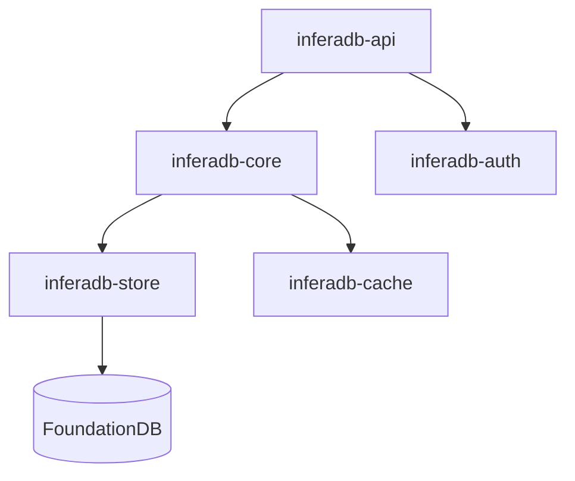

# InferaDB Server

**Authorization engine** — high-performance ReBAC with declarative policies, graph evaluation, and sub-millisecond latency.

[AuthZEN](https://openid.net/wg/authzen/)-compliant. Inspired by [Google Zanzibar](https://research.google/pubs/zanzibar-googles-consistent-global-authorization-system/).

> [!IMPORTANT]
> Under active development. Not production-ready.

## Quick Start

```bash
git clone https://github.com/inferadb/server && cd server
mise trust && mise install && mise run dev
```

Check a permission:

```bash
curl -X POST http://localhost:8080/v1/evaluate \
  -H "Content-Type: application/json" \
  -d '{"evaluations": [{"subject": "user:alice", "resource": "doc:readme", "permission": "viewer"}]}'
# {"results": [{"decision": "allow"}]}
```

Write a relationship:

```bash
curl -X POST http://localhost:8080/v1/relationships/write \
  -H "Content-Type: application/json" \
  -d '{"relationships": [{"resource": "doc:public", "relation": "viewer", "subject": "user:*"}]}'
```

## Features

| Feature          | Description                                       |
| ---------------- | ------------------------------------------------- |
| **Fast**         | <1ms cached, 3-5ms uncached (100K+ RPS)           |
| **Complete API** | Check, Expand, ListResources, ListSubjects, Watch |
| **Multi-Tenant** | Data isolation via Accounts and Vaults            |
| **Wildcards**    | Model public resources with `user:*`              |
| **Observable**   | Prometheus, OpenTelemetry, structured logs        |
| **Storage**      | Memory (dev) or FoundationDB (prod)               |
| **Extensible**   | WASM modules for custom logic                     |

## Architecture



| Crate          | Purpose                            |
| -------------- | ---------------------------------- |
| inferadb-core  | Policy evaluation, IPL interpreter |
| inferadb-api   | REST and gRPC endpoints            |
| inferadb-store | Storage abstraction                |
| inferadb-auth  | JWT validation, JWKS               |
| inferadb-cache | Result caching                     |
| inferadb-wasm  | WebAssembly modules                |

## Configuration

```yaml
server:
  host: "0.0.0.0"
  port: 8080

store:
  backend: "foundationdb" # or "memory"

cache:
  enabled: true
  max_capacity: 100000
  ttl_seconds: 300

auth:
  enabled: true
  management_api_url: "http://localhost:8081"
```

Environment variables use `INFERADB__` prefix. See [docs/guides/configuration.md](docs/guides/configuration.md).

## Development

```bash
cargo test                    # Run tests
cargo build --release         # Release build
cargo clippy -- -D warnings   # Lint
make check                    # All quality checks
```

## Deployment

```bash
docker run -p 8080:8080 inferadb:latest   # Docker
kubectl apply -k k8s/                     # Kubernetes
helm install inferadb ./helm              # Helm
```

See [docs/guides/deployment.md](docs/guides/deployment.md).

## Performance

| Operation        | p50    | p99     | Throughput |
| ---------------- | ------ | ------- | ---------- |
| Check (cached)   | <1ms   | <2ms    | 100K+ RPS  |
| Check (uncached) | 3-5ms  | 8-10ms  | 50K+ RPS   |
| Expand           | 5-15ms | 20-30ms | 20K+ RPS   |

## Documentation

| Topic          | Link                                                               |
| -------------- | ------------------------------------------------------------------ |
| Quickstart     | [docs/quickstart.md](docs/quickstart.md)                           |
| Architecture   | [docs/architecture.md](docs/architecture.md)                       |
| IPL Language   | [docs/core/ipl.md](docs/core/ipl.md)                               |
| Authentication | [docs/security/authentication.md](docs/security/authentication.md) |
| API Reference  | [api/openapi.yaml](api/openapi.yaml)                               |

## License

[Business Source License 1.1](LICENSE.md)
