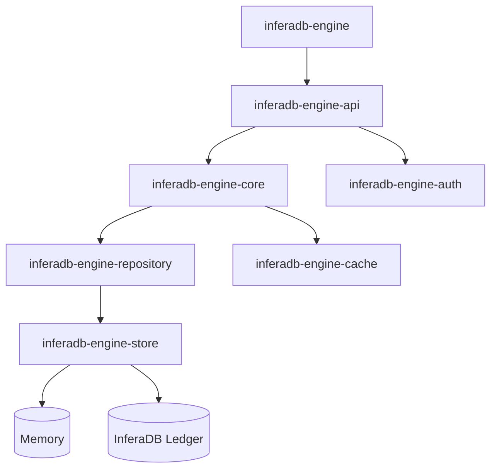

<div align="center">
    <p><a href="https://inferadb.com"></a></p>
    <h1>InferaDB Authorization Engine</h1>
    <p>
        <a href="https://discord.gg/inferadb"></a>
        <a href="https://github.com/inferadb/engine/actions/workflows/ci.yml"></a>
        <a href="https://codecov.io/github/inferadb/engine"></a>
        <a href="#license"></a>
    </p>
    <p>ReBAC engine with declarative policies, graph evaluation, and sub-millisecond latency</p>
</div>

> [!IMPORTANT]
> Under active development. Not production-ready.

Inspired by [Google Zanzibar](https://research.google/pubs/zanzibar-googles-consistent-global-authorization-system/). [AuthZEN](https://openid.net/wg/authzen/) compliant.

## Quick Start

```bash
git clone https://github.com/inferadb/engine && cd engine
mise trust && mise install
cargo run --bin inferadb-engine
```

Check a permission:

```bash
curl -X POST http://localhost:8080/v1/evaluate \
  -H "Content-Type: application/json" \
  -d '{"evaluations": [{"subject": "user:alice", "resource": "doc:readme", "permission": "viewer"}]}'
```

## Features

| Feature | Description |
|---------|-------------|
| **Complete API** | Check, Expand, ListResources, ListSubjects, Watch |
| **Multi-Tenant** | Data isolation via Organizations and Vaults |
| **Wildcards** | Model public resources with `user:*` |
| **Observable** | Prometheus, OpenTelemetry, structured logs |
| **Storage** | Memory (dev) or Ledger (prod) |
| **Extensible** | WASM modules for custom logic |

## Architecture



| Crate | Purpose |
|-------|---------|
| inferadb-engine | Binary entrypoint |
| inferadb-engine-api | REST and gRPC endpoints |
| inferadb-engine-core | Permission evaluation, IPL parser |
| inferadb-engine-auth | JWT validation, JWKS, OAuth |
| inferadb-engine-repository | Domain repositories |
| inferadb-engine-store | Storage trait definitions |
| inferadb-engine-cache | Result caching |
| inferadb-engine-config | Configuration and secrets |
| inferadb-engine-types | Shared type definitions |
| inferadb-engine-const | Shared constants |
| inferadb-engine-observe | Metrics, tracing, logging |
| inferadb-engine-wasm | WebAssembly sandbox |

## Configuration

Configure via `config.yaml` or environment variables (`INFERADB__ENGINE__` prefix):

```yaml
engine:
  listen:
    http: "127.0.0.1:8080"
    grpc: "127.0.0.1:8081"

  storage: "ledger"  # or "memory" for dev

  ledger:
    endpoint: "http://ledger.inferadb:50051"
    client_id: "engine-prod-001"
    namespace_id: 1

  cache:
    enabled: true
    capacity: 100000
    ttl: 300
```

## Development

```bash
just test        # Standard tests
just lint        # Clippy
just fmt         # Format
```

See `just --list` for all commands and [CONTRIBUTING.md](CONTRIBUTING.md) for guidelines.

## License

Dual-licensed under [MIT](LICENSE-MIT) or [Apache 2.0](LICENSE-APACHE).
