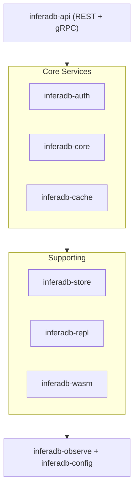

# InferaDB Server

High-performance authorization engine implementing Relationship-Based Access Control (ReBAC) in Rust.

Sub-10ms authorization decisions with intelligent caching, multi-tenant isolation, and a declarative policy language.

> [!IMPORTANT]
> Under active development. Not production-ready.

## Features

- **Fast**: Sub-10ms checks with LRU caching (100K+ RPS cached, 50K+ uncached)
- **Complete API**: Check, Expand, ListResources, ListSubjects, ListRelationships, Watch
- **Multi-Tenant**: Data isolation via Accounts and Vaults
- **Wildcard Support**: Model public resources with `user:*` pattern
- **Real-time**: Watch API streams relationship changes (gRPC/SSE)
- **Observable**: Prometheus metrics, OpenTelemetry tracing, structured logging
- **Flexible Storage**: Memory (dev) or FoundationDB (production)
- **Extensible**: WASM modules for custom authorization logic

## Quick Start

**Prerequisites**: [Mise](https://mise.jdx.dev/), Rust 1.78+

```bash
git clone https://github.com/inferadb/server inferadb && cd inferadb
mise trust && mise install
mise run dev
# Server running at http://localhost:8080
```

```bash
# Authorization check
curl -X POST http://localhost:8080/v1/evaluate \
  -H "Content-Type: application/json" \
  -d '{"evaluations": [{"subject": "user:alice", "resource": "doc:readme", "permission": "viewer"}]}'
# {"results": [{"decision": "allow"}]}

# Wildcard relationship (public access)
curl -X POST http://localhost:8080/v1/relationships/write \
  -H "Content-Type: application/json" \
  -d '{"relationships": [{"resource": "doc:announcement", "relation": "viewer", "subject": "user:*"}]}'
```

See [docs/quickstart.md](docs/quickstart.md) for complete walkthrough.

## Architecture



| Crate            | Purpose                            |
| ---------------- | ---------------------------------- |
| inferadb-core    | Policy evaluation, IPL interpreter |
| inferadb-store   | Storage abstraction (Memory, FDB)  |
| inferadb-api     | REST and gRPC APIs                 |
| inferadb-auth    | JWT/OAuth validation, JWKS caching |
| inferadb-cache   | Authorization result caching       |
| inferadb-repl    | Multi-region replication           |
| inferadb-wasm    | WebAssembly policy modules         |
| inferadb-observe | Metrics, tracing, logging          |
| inferadb-config  | Configuration management           |

See [docs/architecture.md](docs/architecture.md) for details.

## Configuration

Via `config.yaml`, environment variables (`INFERADB__` prefix), or CLI args:

```yaml
server:
  host: "0.0.0.0"
  port: 8080

store:
  backend: "foundationdb"
  connection_string: "/etc/foundationdb/fdb.cluster"

cache:
  enabled: true
  max_capacity: 100000
  ttl_seconds: 300

auth:
  enabled: true
  management_api_url: "http://localhost:8081"
```

See [docs/guides/configuration.md](docs/guides/configuration.md) for all options.

## Authentication

InferaDB integrates with the Management API for authentication. The Management API handles user registration, organizations, and issues Ed25519-signed JWTs.

```yaml
auth:
  enabled: true
  management_api_url: "http://localhost:8081"
  cert_cache_ttl_seconds: 900
  management_verify_vault_ownership: true
```

**JWT Requirements**: Ed25519-signed with claims: `iss`, `sub`, `aud`, `exp`, `iat`, `jti`, `vault`, `account`, `scope`

See [docs/security/authentication.md](docs/security/authentication.md) for complete setup guide, JWT format, troubleshooting, and performance tuning.

## Development

```bash
mise trust && mise install     # One-time setup
cargo test                     # Run tests
cargo build --release          # Build release
cargo clippy -- -D warnings    # Lint
make check                     # All quality checks
make dev                       # Dev server with auto-reload
```

See [docs/guides/building.md](docs/guides/building.md) for detailed setup.

## Deployment

```bash
# Docker
docker run -p 8080:8080 inferadb:latest

# Kubernetes
kubectl apply -k k8s/

# Helm
helm install inferadb ./helm

# Terraform (AWS/GCP)
cd terraform/examples/aws-complete && terraform apply
```

See [docs/guides/deployment.md](docs/guides/deployment.md) for production guide.

## Performance

| Operation        | p50    | p99     | Throughput |
| ---------------- | ------ | ------- | ---------- |
| Check (cached)   | <1ms   | <2ms    | 100K+ RPS  |
| Check (uncached) | 3-5ms  | 8-10ms  | 50K+ RPS   |
| Expand           | 5-15ms | 20-30ms | 20K+ RPS   |
| Write            | 2-5ms  | 10-15ms | 30K+ RPS   |

_8-core CPU, memory backend, single region_

See [docs/operations/performance.md](docs/operations/performance.md) for benchmarks.

## Documentation

| Category        | Links                                                                                                                                                             |
| --------------- | ----------------------------------------------------------------------------------------------------------------------------------------------------------------- |
| Getting Started | [Quickstart](docs/quickstart.md) · [Architecture](docs/architecture.md) · [Multi-Tenancy](docs/architecture/multi-tenancy.md)                                     |
| Guides          | [Building](docs/guides/building.md) · [Configuration](docs/guides/configuration.md) · [Deployment](docs/guides/deployment.md) · [Testing](docs/guides/testing.md) |
| API             | [Overview](api/README.md) · [REST](api/rest.md) · [gRPC](api/grpc.md) · [OpenAPI](api/openapi.yaml) · [Swagger UI](api/swagger-ui.html)                           |
| Core            | [Evaluation](docs/core/evaluation.md) · [IPL Language](docs/core/ipl.md) · [Caching](docs/core/caching.md) · [Revisions](docs/core/revisions.md)                  |
| Operations      | [Observability](docs/operations/observability/README.md) · [Performance](docs/operations/performance.md) · [SLOs](docs/operations/slos.md)                        |
| Security        | [Authentication](docs/security/authentication.md) · [Hardening](docs/security/hardening.md) · [Rate Limiting](docs/security/ratelimiting.md)                      |

Browse all: [docs/README.md](docs/README.md)

## Contributing

See [CONTRIBUTING.md](CONTRIBUTING.md) and [docs/developers/README.md](docs/developers/README.md).

## License

[Business Source License 1.1](LICENSE.md) — Free for non-commercial use.
