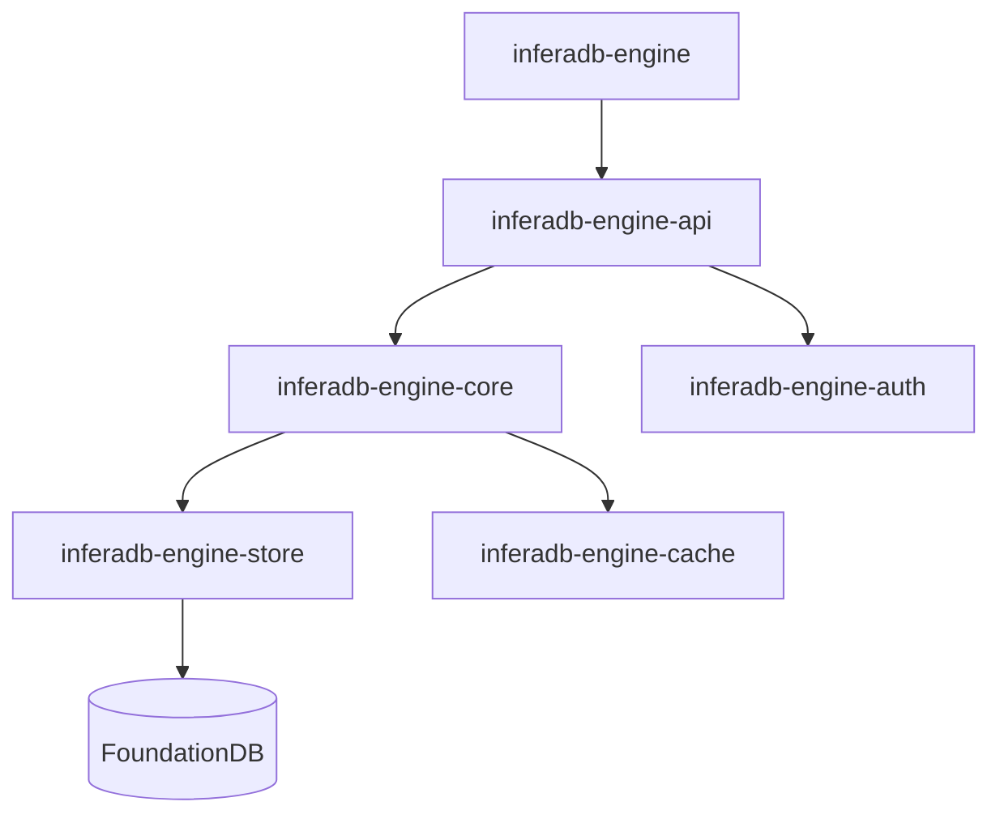

<div align="center">
    <p><a href="https://inferadb.com"></a></p>
    <h1>InferaDB Authorization Engine</h1>
    <p>
        <a href="https://codecov.io/github/inferadb/engine"></a>
        <a href="#license"></a>
    </p>
    <p>High-performance ReBAC with declarative policies, graph evaluation, and sub-millisecond latency</p>
</div>

> [!IMPORTANT]
> Under active development. Not production-ready.

Inspired by [Google Zanzibar](https://research.google/pubs/zanzibar-googles-consistent-global-authorization-system/). [AuthZEN](https://openid.net/wg/authzen/) compliant.

## Quick Start

```bash
git clone https://github.com/inferadb/engine && cd engine
make setup && make dev
```

Check a permission:

```bash
curl -N -X POST http://localhost:8080/v1/evaluate \
  -H "Content-Type: application/json" \
  -d '{"evaluations": [{"subject": "user:alice", "resource": "doc:readme", "permission": "viewer"}]}'
```

Response (SSE stream):

```text
data: {"decision":"allow","index":0}

event: summary
data: {"total":1,"complete":true}
```

Write a relationship:

```bash
curl -X POST http://localhost:8080/v1/relationships/write \
  -H "Content-Type: application/json" \
  -d '{"relationships": [{"resource": "doc:public", "relation": "viewer", "subject": "user:*"}]}'
```

## Performance

| Operation        | p50    | p99     | Throughput |
| ---------------- | ------ | ------- | ---------- |
| Check (cached)   | <1ms   | <2ms    | 100K+ RPS  |
| Check (uncached) | 3-5ms  | 8-10ms  | 50K+ RPS   |
| Expand           | 5-15ms | 20-30ms | 20K+ RPS   |

## Features

| Feature          | Description                                       |
| ---------------- | ------------------------------------------------- |
| **Complete API** | Check, Expand, ListResources, ListSubjects, Watch |
| **Multi-Tenant** | Data isolation via Accounts and Vaults            |
| **Wildcards**    | Model public resources with `user:*`              |
| **Observable**   | Prometheus, OpenTelemetry, structured logs        |
| **Storage**      | Memory (dev) or FoundationDB (prod)               |
| **Extensible**   | WASM modules for custom logic                     |

## Architecture



| Crate                     | Purpose                            |
| ------------------------- | ---------------------------------- |
| inferadb-engine           | Binary entrypoint                  |
| inferadb-engine-api       | REST and gRPC endpoints            |
| inferadb-engine-core      | Policy evaluation, IPL interpreter |
| inferadb-engine-auth      | JWT validation, JWKS               |
| inferadb-engine-store     | Storage abstraction                |
| inferadb-engine-cache     | Result caching                     |
| inferadb-engine-config    | Configuration loading              |
| inferadb-engine-types     | Shared type definitions            |
| inferadb-engine-observe   | Metrics and tracing                |
| inferadb-engine-wasm      | WebAssembly modules                |
| inferadb-engine-discovery | Service mesh discovery             |

## Configuration

```yaml
engine:
  listen:
    http: "0.0.0.0:8080"
    grpc: "0.0.0.0:8081"
    mesh: "0.0.0.0:8082"

  cache:
    enabled: true
    capacity: 100000
    ttl: 300

  mesh:
    url: "http://localhost:9092"
```

Environment variables use `INFERADB__` prefix (e.g., `INFERADB__ENGINE__LISTEN__HTTP`).

See [docs/guides/configuration.md](docs/guides/configuration.md).

## Development

```bash
make setup                    # One-time setup
make dev                      # Dev server with auto-reload
make test                     # Run tests
make check                    # Format, lint, audit
cargo build --release         # Release build
```

## Deployment

```bash
docker run -p 8080:8080 inferadb/engine:latest
kubectl apply -k k8s/
helm install inferadb ./helm
```

See [docs/guides/deployment.md](docs/guides/deployment.md).

## Documentation

| Topic          | Link                                                               |
| -------------- | ------------------------------------------------------------------ |
| Quickstart     | [docs/quickstart.md](docs/quickstart.md)                           |
| Architecture   | [docs/architecture.md](docs/architecture.md)                       |
| IPL Language   | [docs/core/ipl.md](docs/core/ipl.md)                               |
| Authentication | [docs/security/authentication.md](docs/security/authentication.md) |
| API Reference  | [api/openapi.yaml](api/openapi.yaml)                               |

## License

Licensed under either of:

- [Apache License, Version 2.0](LICENSE-APACHE)
- [MIT License](LICENSE-MIT)

at your option.
