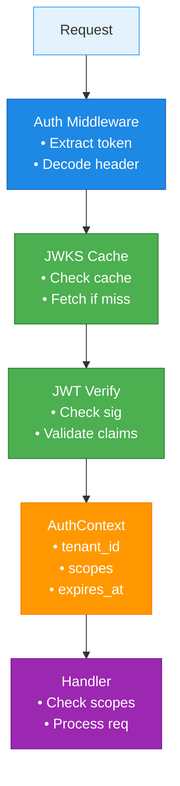

# InferaDB Authentication

This crate provides JWT-based authentication and authorization for the InferaDB Policy Decision Engine.

## Features

- ✅ **Private-Key JWT (RFC 7523)**: Tenant SDK/CLI authentication with Ed25519 signatures
- ✅ **JWKS Caching**: Efficient public key fetching with TTL and stale-while-revalidate
- ✅ **Axum Middleware**: Drop-in authentication for REST APIs
- ✅ **Scope-Based Authorization**: Fine-grained permission control
- ✅ **Tenant Isolation**: Multi-tenant support with tenant-specific JWKS
- ✅ **Security-First**: Only asymmetric algorithms (EdDSA, RS256), no unsafe code

## Quick Start

### 1. Server Initialization

```rust
use inferadb_auth::jwks_cache::JwksCache;
use std::sync::Arc;
use std::time::Duration;

// Create JWKS cache
let cache = Arc::new(
    moka::future::Cache::builder()
        .max_capacity(1000)
        .time_to_live(Duration::from_secs(300))
        .build()
);

let jwks_cache = Arc::new(JwksCache::new(
    "https://auth.example.com/tenants".to_string(),
    cache,
    Duration::from_secs(300),
));
```

### 2. Apply Middleware to Router

```rust
use axum::{Router, routing::post};
use inferadb_auth::middleware::optional_auth_middleware;

let protected_routes = Router::new()
    .route("/check", post(check_handler))
    .route("/write", post(write_handler));

// Apply auth middleware
let protected_routes = protected_routes.layer(
    axum::middleware::from_fn(move |req, next| {
        let jwks_cache = Arc::clone(&jwks_cache);
        optional_auth_middleware(true, jwks_cache, req, next)
    })
);

// Health endpoint stays unprotected
let app = Router::new()
    .route("/health", get(health_check))
    .merge(protected_routes);
```

### 3. Use Extractors in Handlers

```rust
use axum::{Json, extract::State};
use inferadb_auth::extractor::OptionalAuth;
use inferadb_auth::middleware::require_scope;

async fn check_handler(
    auth: OptionalAuth,
    State(state): State<AppState>,
    Json(request): Json<CheckRequest>,
) -> Result<Json<CheckResponse>> {
    // Validate authentication if enabled
    if state.config.auth.enabled {
        if let Some(auth_ctx) = auth.0 {
            // Require specific scope
            require_scope(&auth_ctx, "inferadb.check")?;

            // Access tenant info
            tracing::info!("Request from tenant: {}", auth_ctx.tenant_id);
        } else {
            return Err(ApiError::Unauthorized("Authentication required".into()));
        }
    }

    // Process request...
    Ok(Json(response))
}
```

## Extractors

### `OptionalAuth` - Flexible Authentication

Returns `Some(AuthContext)` if authenticated, `None` otherwise. Never fails, useful for endpoints that work with or without auth.

```rust
use inferadb_auth::extractor::OptionalAuth;

async fn handler(auth: OptionalAuth) -> Result<Json<Response>> {
    if let Some(auth_ctx) = auth.0 {
        println!("Authenticated: {}", auth_ctx.tenant_id);
    } else {
        println!("Unauthenticated request");
    }
    Ok(Json(response))
}
```

### `RequireAuth` - Mandatory Authentication

Returns `AuthContext` or 401 if not authenticated.

```rust
use inferadb_auth::extractor::RequireAuth;

async fn protected_handler(
    RequireAuth(auth): RequireAuth,
) -> Result<Json<Response>> {
    // auth is guaranteed to be present
    println!("Tenant: {}", auth.tenant_id);
    Ok(Json(response))
}
```

## Scope Validation

### Single Scope

```rust
use inferadb_auth::middleware::require_scope;

// Require exactly one scope
require_scope(&auth_ctx, "inferadb.write")?;
```

### Multiple Scopes (Any)

```rust
use inferadb_auth::middleware::require_any_scope;

// Require at least one of these scopes
require_any_scope(&auth_ctx, &["inferadb.expand", "inferadb.check"])?;
```

### Manual Validation

```rust
if !auth_ctx.has_scope("inferadb.admin") {
    return Err(ApiError::Forbidden("Admin access required".into()));
}
```

## Token Format

### Private-Key JWT (Tenant SDK)

**Header:**

```json
{
    "alg": "EdDSA",
    "kid": "tenant-key-2025-01",
    "typ": "JWT"
}
```

**Payload:**

```json
{
    "iss": "tenant:acme",
    "sub": "tenant:acme",
    "aud": "https://api.inferadb.com/evaluate",
    "exp": 1730000060,
    "iat": 1730000000,
    "jti": "b2df428b9929d3ace7c598bbf4e496b2",
    "scope": "inferadb.check inferadb.write"
}
```

Tenant ID is extracted from `iss` by removing the `tenant:` prefix.

## JWKS Caching

The JWKS cache provides:

- **TTL-based caching**: Public keys cached for configurable duration
- **Stale-while-revalidate**: Serve stale keys while refreshing in background
- **Thundering-herd protection**: Deduplicate concurrent requests per tenant
- **Per-tenant isolation**: Each tenant has independent JWKS

### Cache Behavior

1. **Cache Hit**: Return immediately (< 1ms)
2. **Cache Stale**: Return stale key + refresh in background
3. **Cache Miss**: Fetch from Control Plane (blocking)

## Configuration

```yaml
auth:
    enabled: true
    jwks_base_url: "https://auth.inferadb.com/tenants"
    jwks_cache_ttl: 300 # 5 minutes
```

### Development Mode

Disable authentication for local development:

```yaml
auth:
    enabled: false
```

⚠️ **Warning**: Only use `enabled: false` in development environments. Production systems must always have authentication enabled.

## Error Handling

Authentication errors return proper HTTP status codes with `WWW-Authenticate` headers:

### 401 Unauthorized

- Missing Authorization header
- Malformed bearer token
- Invalid JWT format
- Expired token
- Invalid signature

**Response:**

```http
HTTP/1.1 401 Unauthorized
WWW-Authenticate: Bearer realm="InferaDB", error="invalid_token"
Content-Type: application/json

{"error": "Token expired"}
```

### 403 Forbidden

- Invalid scope
- Invalid audience
- Cross-tenant access

**Response:**

```http
HTTP/1.1 403 Forbidden
Content-Type: application/json

{"error": "Invalid scope: Required scope 'inferadb.write' not present"}
```

## Testing

### Unit Tests

```bash
cargo test -p inferadb-auth
```

**Coverage:**

- 36 unit tests for core functionality
- 18 integration tests for JWKS caching and JWT verification

### Integration Tests

```bash
cargo test -p inferadb-api --test auth_integration_tests
```

**Coverage:**

- Missing token handling
- Malformed headers
- Auth disabled mode
- Health endpoint remains unprotected

## Security Considerations

### ✅ Implemented

- Only asymmetric algorithms (EdDSA, RS256)
- Symmetric algorithms (HS256) explicitly rejected
- No unsafe code in this crate
- JWT expiration validation
- Signature verification against JWKS
- Audience validation
- Tenant isolation

### ⚠️ Future Enhancements

- Token replay protection (requires Redis)
- Rate limiting per tenant
- Token revocation (requires stateful backend)
- OIDC Discovery support

## Architecture



## Examples

See the [integration tests](tests/auth_integration_tests.rs) in `inferadb-api` for complete examples of:

- Setting up authentication
- Making authenticated requests
- Handling auth errors
- Testing with mock JWKS servers

## License

Same as the InferaDB project.
