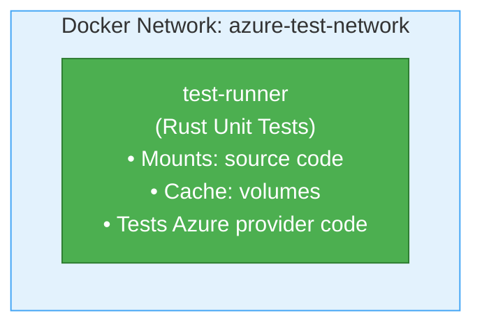

# Azure Key Vault Integration Tests - Docker Environment

This directory contains a **dedicated Docker environment** for running Azure Key Vault unit tests.

**Note:** Microsoft Azure does not provide an official Key Vault emulator. This environment runs unit tests that don't require real Azure credentials. Integration tests that require real Azure access are marked with `#[ignore]` and must be run separately with proper credentials.

## Overview

This setup provides:

- **Test runner** with Rust environment
- **Automated unit test execution** for Azure Key Vault code
- **Complete isolation** for testing code paths
- **Zero Azure credentials** required for unit tests

## Quick Start

### Prerequisites

- Docker and Docker Compose installed
- At least 2GB of available RAM
- At least 3GB of disk space

### Run Tests

```bash
# From the server directory
./docker/azure-integration-tests/test.sh
```

This will:

1. Build the test environment
2. Run Azure Key Vault unit tests
3. Clean up automatically

**For full integration tests with real Azure:**

```bash
# 1. Set up Azure CLI authentication
az login

# 2. Create a Key Vault (if you don't have one)
az keyvault create --name your-test-vault --resource-group your-rg --location eastus

# 3. Set your Azure Key Vault URL
export AZURE_VAULT_URL=https://your-test-vault.vault.azure.net

# 4. Create a test secret
az keyvault secret set --vault-name your-test-vault --name test-secret --value "test-value"

# 5. Run integration tests
cargo test --package inferadb-config --features azure-secrets test_azure_secrets_provider -- --ignored --nocapture
```

## Usage

### Basic Commands

```bash
# Run tests (builds, runs, and cleans up)
./docker/azure-integration-tests/test.sh

# Get a shell in the test container for debugging
./docker/azure-integration-tests/shell.sh

# Clean up all test resources
./docker/azure-integration-tests/cleanup.sh
```

### Advanced Usage

#### Keep Environment Running After Tests

Useful for debugging test failures:

```bash
# Start environment manually
cd docker/azure-integration-tests
docker-compose up -d

# Run tests manually
docker-compose exec test-runner /workspace/docker/azure-integration-tests/run-tests.sh

# Access container for debugging
./shell.sh

# When done
docker-compose down
```

#### Manual Test Execution

```bash
# Start environment
cd docker/azure-integration-tests
docker-compose up -d

# Access container
docker-compose exec test-runner bash

# Inside container - run specific tests
cargo test -p inferadb-config --features azure-secrets --lib azure

# Exit and cleanup
exit
docker-compose down
```

## Architecture

### Components

1. **Test Runner Container** (`test-runner`)
   - Based on `rust:1-slim` with nightly toolchain
   - All Rust dependencies cached
   - Source code mounted for live development
   - Runs unit tests that don't require real Azure

2. **Shared Network** (`azure-test-network`)
   - Isolated bridge network for test isolation

3. **Volumes**
   - `cargo-registry`: Cached cargo dependencies
   - `cargo-git`: Cached git dependencies
   - `target-cache`: Compiled artifacts cache

### Architecture



**Note:** Since Azure doesn't provide a Key Vault emulator, this environment focuses on unit testing the Azure Key Vault provider code. Integration tests requiring real Azure credentials must be run separately.

## Files

- **`Dockerfile`** - Test runner container definition
- **`docker-compose.yml`** - Container orchestration
- **`run-tests.sh`** - Main test execution script
- **`test.sh`** - Convenience wrapper for running tests
- **`shell.sh`** - Get interactive shell in test container
- **`cleanup.sh`** - Remove all test resources
- **`README.md`** - This file

## Environment Variables

### Test Runner

- `AZURE_VAULT_URL`: Vault URL for integration tests (default: `https://test-vault.vault.azure.net`)
- `RUST_BACKTRACE`: Enable Rust backtraces (default: `1`)
- `RUST_LOG`: Logging level (default: `debug`)

**For integration tests with real Azure:**

- `AZURE_TENANT_ID`: Azure AD tenant ID
- `AZURE_CLIENT_ID`: Service principal client ID
- `AZURE_CLIENT_SECRET`: Service principal client secret
- Or use Azure CLI authentication via `az login`

## Troubleshooting

### Tests Fail with Connection Error

**Symptom:** Tests report "Failed to connect to Azure" or timeout errors.

**Solutions:**

This is expected for unit tests. The unit tests don't require actual Azure connectivity. If you're trying to run integration tests, follow the "For full integration tests with real Azure" instructions above.

### Build Fails with "No Space Left on Device"

**Solution:** Clean up Docker resources

```bash
./docker/azure-integration-tests/cleanup.sh
docker system prune -a
```

### Tests Run Slowly

**Solution:** Increase Docker resource limits

- Docker Desktop → Settings → Resources
- Increase CPUs to 2+
- Increase Memory to 4GB+

## Azure Key Vault Features

Azure Key Vault provides:

- **Secrets management** - Store and manage sensitive information
- **Key management** - Create and control encryption keys
- **Certificate management** - Provision, manage, and deploy certificates
- **Access policies** - Control who can access secrets
- **Monitoring and logging** - Audit access to secrets

### Limitations (Without Real Azure)

When running unit tests locally without Azure:

- No actual secret storage (tests use mocks)
- Simplified authentication model
- No audit logging
- Some advanced features may not be testable
- Performance characteristics differ from real Azure

## Development Workflow

### Adding New Tests

1. Write tests in `crates/inferadb-config/src/secrets.rs`
2. Ensure tests are marked with `#[ignore]` if they require real Azure
3. Run tests: `./docker/azure-integration-tests/test.sh`
4. Iterate in interactive mode:

   ```bash
   ./docker/azure-integration-tests/shell.sh
   # Inside container
   cargo test -p inferadb-config --features azure-secrets <test_name>
   ```

### Debugging Test Failures

1. Start environment:

   ```bash
   cd docker/azure-integration-tests
   docker-compose up -d
   ```

2. Access container:

   ```bash
   ./shell.sh
   ```

3. Re-run specific test:

   ```bash
   RUST_BACKTRACE=full cargo test -p inferadb-config \
     --features azure-secrets \
     test_name -- --nocapture
   ```

## CI/CD Integration

### GitHub Actions Example

```yaml
name: Azure Integration Tests

on: [push, pull_request]

jobs:
  azure-tests:
    runs-on: ubuntu-latest

    steps:
      - uses: actions/checkout@v3

      - name: Run Azure Integration Tests
        run: |
          cd server
          ./docker/azure-integration-tests/test.sh
```

### GitLab CI Example

```yaml
azure-integration-tests:
  image: docker:latest
  services:
    - docker:dind
  script:
    - cd server
    - ./docker/azure-integration-tests/test.sh
```

## Performance Considerations

### Resource Usage

- **Test Runner:** ~2GB RAM during compilation, ~300MB during tests
- **Volumes:** ~1-2GB for cached dependencies and builds

### Optimization Tips

1. **Reuse volumes** between test runs (automatic with docker-compose)
2. **Pre-build images** in CI
3. **Use cache mounts** (already configured)
4. **Run tests in parallel** where possible

## Security Notes

⚠️ **For Testing Only - Not for Production**

- Unit tests use mock implementations
- No real authentication or encryption
- Data is ephemeral (cleared on container restart)

**Do not:**

- Use real Azure credentials in this environment (unless running integration tests)
- Store sensitive data in unit tests
- Connect production services to test environment
- Rely on this for production testing

## Comparison with Real Azure

| Feature           | Unit Tests (Local) | Real Azure Key Vault      |
| ----------------- | ------------------ | ------------------------- |
| Cost              | Free               | Pay per operation         |
| Speed             | Fast (local)       | Network latency           |
| Encryption        | Mocked             | Real HSM/software crypto  |
| Authentication    | Mocked             | Full Azure AD integration |
| Audit Logs        | None               | Azure Monitor logs        |
| High Availability | Single container   | Multi-region              |
| Data Persistence  | Ephemeral          | Durable storage           |

## Support

For issues specific to:

- **This Docker setup:** Check this README and troubleshooting section
- **Azure Key Vault:** See Azure documentation at <https://docs.microsoft.com/azure/key-vault/>
- **InferaDB:** See main project documentation

## License

This test environment follows the same license as the main InferaDB project.
