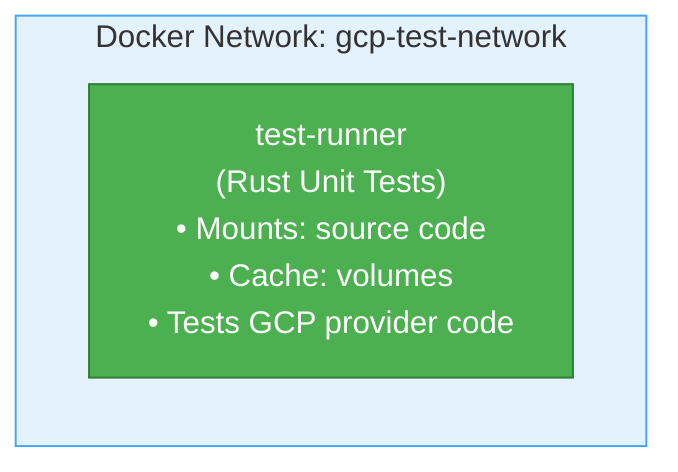

# GCP Secret Manager Integration Tests - Docker Environment

This directory contains a **dedicated Docker environment** for running GCP Secret Manager unit tests.

**Note:** Google Cloud does not provide an official Secret Manager emulator. This environment runs unit tests that don't require real GCP credentials. Integration tests that require real GCP access are marked with `#[ignore]` and must be run separately with proper credentials.

## Overview

This setup provides:

- **Test runner** with Rust environment
- **Automated unit test execution** for GCP Secret Manager code
- **Complete isolation** for testing code paths
- **Zero GCP credentials** required for unit tests

## Quick Start

### Prerequisites

- Docker and Docker Compose installed
- At least 2GB of available RAM
- At least 3GB of disk space

### Run Tests

```bash
# From the server directory
./docker/gcp-integration-tests/test.sh
```

This will:

1. Build the test environment
2. Run GCP Secret Manager unit tests
3. Clean up automatically

**For full integration tests with real GCP:**

```bash
# 1. Set up Application Default Credentials
gcloud auth application-default login

# 2. Set your GCP project ID
export GCP_PROJECT_ID=your-project-id

# 3. Create a test secret in your GCP project
gcloud secrets create test-secret --data-file=- <<< "test-value"

# 4. Run integration tests
cargo test --package inferadb-engine-config --features gcp-secrets test_gcp_secrets_provider -- --ignored --nocapture
```

## Usage

### Basic Commands

```bash
# Run tests (builds, runs, and cleans up)
./docker/gcp-integration-tests/test.sh

# Get a shell in the test container for debugging
./docker/gcp-integration-tests/shell.sh

# Clean up all test resources
./docker/gcp-integration-tests/cleanup.sh
```

### Advanced Usage

#### Keep Environment Running After Tests

Useful for debugging test failures:

```bash
# Start environment manually
cd docker/gcp-integration-tests
docker-compose up -d

# Run tests manually
docker-compose exec test-runner /workspace/docker/gcp-integration-tests/run-tests.sh

# Access container for debugging
./shell.sh

# When done
docker-compose down
```

#### Manual Test Execution

```bash
# Start environment
cd docker/gcp-integration-tests
docker-compose up -d

# Access container
docker-compose exec test-runner bash

# Inside container - run specific tests
cargo test -p inferadb-engine-config --features gcp-secrets --lib gcp

# Check emulator secrets
gcloud secrets list --project=test-project

# View a specific secret
gcloud secrets versions access latest --secret=test-secret-1 --project=test-project

# Exit and cleanup
exit
docker-compose down
```

## Architecture

### Components

1. **Test Runner Container** (`test-runner`)
   - Based on `rust:1-slim` with nightly toolchain
   - All Rust dependencies cached
   - Source code mounted for live development
   - Runs unit tests that don't require real GCP

2. **Shared Network** (`gcp-test-network`)
   - Isolated bridge network for test isolation

3. **Volumes**
   - `cargo-registry`: Cached cargo dependencies
   - `cargo-git`: Cached git dependencies
   - `target-cache`: Compiled artifacts cache

### Architecture



**Note:** Since GCP doesn't provide a Secret Manager emulator, this environment focuses on unit testing the GCP Secret Manager provider code. Integration tests requiring real GCP credentials must be run separately.

## Files

- **`Dockerfile`** - Test runner container definition
- **`docker-compose.yml`** - Multi-container orchestration
- **`run-tests.sh`** - Main test execution script
- **`test.sh`** - Convenience wrapper for running tests
- **`shell.sh`** - Get interactive shell in test container
- **`cleanup.sh`** - Remove all test resources
- **`README.md`** - This file

## Environment Variables

### Test Runner

- `GCP_PROJECT_ID`: Project ID for integration tests (default: `test-project`)
- `RUST_BACKTRACE`: Enable Rust backtraces (default: `1`)
- `RUST_LOG`: Logging level (default: `debug`)

**For integration tests with real GCP:**

- `GOOGLE_APPLICATION_CREDENTIALS`: Path to service account JSON key file
- Or use Application Default Credentials via `gcloud auth application-default login`

## Troubleshooting

### Tests Fail with Connection Error

**Symptom:** Tests report "Failed to connect to GCP" or timeout errors.

**Solutions:**

This is expected behavior for unit tests - they don't require actual GCP connectivity. Unit tests mock the GCP Secret Manager API. If you're running integration tests with real GCP, ensure:

1. You have valid Application Default Credentials: `gcloud auth application-default login`
2. Your `GCP_PROJECT_ID` is set correctly
3. The test secrets exist in your GCP project

### Build Fails with "No Space Left on Device"

**Solution:** Clean up Docker resources

```bash
./docker/gcp-integration-tests/cleanup.sh
docker system prune -a
```

### Tests Run Slowly

**Solution:** Increase Docker resource limits

- Docker Desktop → Settings → Resources
- Increase CPUs to 2+
- Increase Memory to 4GB+

## GCP Secret Manager Features

GCP Secret Manager provides:

- **Secrets management** - Store and manage sensitive information
- **Secret versioning** - Automatic version tracking
- **IAM integration** - Fine-grained access control
- **Audit logging** - Cloud Audit Logs integration
- **Replication** - Automatic multi-region replication

### Testing Without Real GCP

Since GCP doesn't provide a Secret Manager emulator, this environment:

- Runs unit tests that mock the GCP API
- Integration tests requiring real GCP must be run separately
- Uses `#[ignore]` attribute for tests needing real credentials

## Development Workflow

### Adding New Tests

1. Write tests in `crates/inferadb-engine-config/src/secrets.rs`
2. Mark integration tests with `#[ignore]` if they require real GCP
3. Run tests: `./docker/gcp-integration-tests/test.sh`
4. Iterate in interactive mode:

   ```bash
   ./docker/gcp-integration-tests/shell.sh
   # Inside container
   cargo test -p inferadb-engine-config --features gcp-secrets <test_name>
   ```

### Debugging Test Failures

1. Start environment:

   ```bash
   cd docker/gcp-integration-tests
   docker-compose up -d
   ```

2. Access container:

   ```bash
   ./shell.sh
   ```

3. Inspect emulator state:

   ```bash
   # List all secrets
   gcloud secrets list --project=test-project

   # Get secret value
   gcloud secrets versions access latest \
     --secret=test-secret-1 \
     --project=test-project

   # Describe secret
   gcloud secrets describe test-secret-1 --project=test-project
   ```

4. Re-run specific test:

   ```bash
   RUST_BACKTRACE=full cargo test -p inferadb-engine-config \
     --features gcp-secrets \
     test_name -- --nocapture
   ```

## CI/CD Integration

### GitHub Actions Example

```yaml
name: GCP Integration Tests

on: [push, pull_request]

jobs:
  gcp-tests:
    runs-on: ubuntu-latest

    steps:
      - uses: actions/checkout@v3

      - name: Run GCP Integration Tests
        run: |
          cd server
          ./docker/gcp-integration-tests/test.sh
```

### GitLab CI Example

```yaml
gcp-integration-tests:
  image: docker:latest
  services:
    - docker:dind
  script:
    - cd server
    - ./docker/gcp-integration-tests/test.sh
```

## Performance Considerations

### Resource Usage

- **Emulator Container:** ~300MB RAM, 1 CPU under normal load
- **Test Runner:** ~2GB RAM during compilation, ~300MB during tests
- **Volumes:** ~1-2GB for cached dependencies and builds

### Optimization Tips

1. **Reuse volumes** between test runs (automatic with docker-compose)
2. **Pre-build images** in CI
3. **Use cache mounts** (already configured)
4. **Run tests in parallel** where possible

## Security Notes

⚠️ **For Testing Only - Not for Production**

- Unit tests use mock implementations
- No real encryption or authentication
- Data is ephemeral (cleared on container restart)

**Do not:**

- Use real GCP credentials in this environment (unless running integration tests)
- Store sensitive data in unit tests
- Connect production services to test environment
- Rely on this for production testing

## Comparison with Real GCP

| Feature           | Unit Tests (Local) | Real GCP Secret Manager  |
| ----------------- | ------------------ | ------------------------ |
| Cost              | Free               | Pay per secret/operation |
| Speed             | Fast (local)       | Network latency          |
| Encryption        | Mocked             | Real KMS encryption      |
| IAM               | Mocked             | Full IAM integration     |
| Audit Logs        | None               | Cloud Audit Logs         |
| Secret Rotation   | Mocked             | Full integration         |
| High Availability | Single container   | Multi-region             |
| Data Persistence  | Ephemeral          | Durable storage          |

## Support

For issues specific to:

- **This Docker setup:** Check this README and troubleshooting section
- **GCP Secret Manager:** <https://cloud.google.com/secret-manager/docs>
- **InferaDB:** See main project documentation

## License

This test environment follows the same license as the main InferaDB project.
