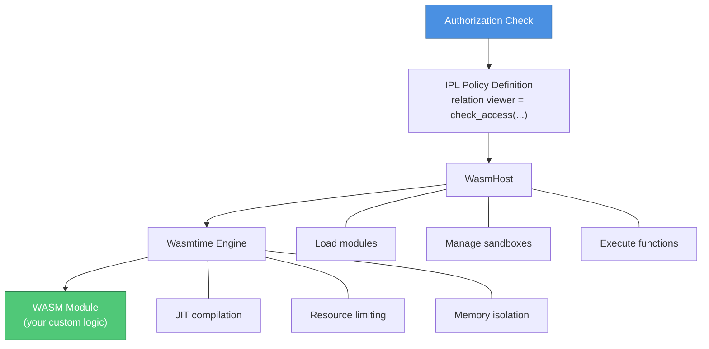

# WASM Integration

InferaDB supports custom policy logic through WebAssembly (WASM) modules. This allows you to implement complex, attribute-based authorization rules that go beyond simple relationship graphs.

## Overview

WASM modules in InferaDB:

- **Sandboxed**: Run in isolated environments with strict resource limits
- **Deterministic**: Same inputs always produce same outputs
- **High-Performance**: Near-native execution speed with wasmtime
- **Language-Agnostic**: Write in Rust, C, C++, AssemblyScript, or any WASM-compatible language

## Use Cases

### Attribute-Based Access Control (ABAC)

Check attributes like time, IP address, or custom properties:

```rust
// Allow access only during business hours
fn check_business_hours(context: &Context) -> bool {
    let hour = context.get_time().hour();
    hour >= 9 && hour < 17
}
```

### Complex Business Logic

Implement rules that don't fit relationship-based models:

```rust
// Allow if user's clearance level >= resource classification
fn check_clearance(subject_level: u8, resource_level: u8) -> bool {
    subject_level >= resource_level
}
```

### Dynamic Policies

Policies that change based on runtime conditions:

```rust
// Allow up to N concurrent sessions
fn check_session_limit(user: &str, current_sessions: u32) -> bool {
    let limit = get_user_tier_limit(user);
    current_sessions < limit
}
```

## Architecture



## WASM Module Contract

### Function Signature

All policy functions must have this signature:

```wat
(func (export "check") (result i32)
  ...
  i32.const 1  ;; 1 = allow, 0 = deny
)
```

**Return Value**:

- `0` = Deny
- Non-zero (typically `1`) = Allow

### Execution Context

The execution context is passed to the module and contains:

```rust
pub struct ExecutionContext {
    pub subject: String,    // e.g., "user:alice"
    pub resource: String,   // e.g., "doc:readme"
    pub permission: String, // e.g., "viewer"
    pub context: Option<serde_json::Value>, // Optional context data
}
```

### Host Functions

WASM modules can call these host functions:

#### `log(ptr: i32, len: i32)`

Log a message from the WASM module (for debugging).

```wat
(import "host" "log" (func $log (param i32 i32)))

(data (i32.const 0) "Access granted")

(func (export "check") (result i32)
  ;; Log message
  i32.const 0   ;; pointer to string
  i32.const 14  ;; length
  call $log

  i32.const 1   ;; allow
)
```

## Creating WASM Modules

### Rust Example

**Cargo.toml**:

```toml
[package]
name = "business-hours-policy"
version = "0.1.0"
edition = "2021"

[lib]
crate-type = ["cdylib"]

[dependencies]
# No dependencies needed for simple policies
```

**src/lib.rs**:

```rust
#[no_mangle]
pub extern "C" fn check() -> i32 {
    // Get current hour (simplified - in reality you'd get this from context)
    let hour = 10; // 10 AM

    // Allow access during business hours (9 AM - 5 PM)
    if hour >= 9 && hour < 17 {
        1 // Allow
    } else {
        0 // Deny
    }
}
```

**Build**:

```bash
cargo build --target wasm32-unknown-unknown --release
```

**Output**: `target/wasm32-unknown-unknown/release/business_hours_policy.wasm`

### AssemblyScript Example

**policy.ts**:

```typescript
export function check(): i32 {
  // Simple attribute check
  const userLevel = 5;
  const requiredLevel = 3;

  if (userLevel >= requiredLevel) {
    return 1; // Allow
  } else {
    return 0; // Deny
  }
}
```

**Build**:

```bash
npm install -g assemblyscript
asc policy.ts -o policy.wasm
```

### C Example

**policy.c**:

```c
int check() {
    // Simple time-based check
    // In reality, you'd get time from context
    int hour = 14; // 2 PM

    if (hour >= 9 && hour < 17) {
        return 1; // Allow
    } else {
        return 0; // Deny
    }
}
```

**Build**:

```bash
clang --target=wasm32 -nostdlib -Wl,--no-entry -Wl,--export-all -o policy.wasm policy.c
```

### WAT (WebAssembly Text) Example

**policy.wat**:

```wat
(module
  ;; Import host log function
  (import "host" "log" (func $log (param i32 i32)))

  ;; Memory for strings
  (memory (export "memory") 1)
  (data (i32.const 0) "Access granted")

  ;; Policy function
  (func (export "check") (result i32)
    ;; Log message
    i32.const 0
    i32.const 14
    call $log

    ;; Always allow
    i32.const 1
  )
)
```

**Build**:

```bash
wat2wasm policy.wat -o policy.wasm
```

## Loading and Executing Modules

### Load Module

```rust
use inferadb_wasm::{WasmHost, ExecutionContext};

let host = WasmHost::new()?;

// Load WASM bytecode
let wasm_bytes = std::fs::read("policy.wasm")?;
host.load_module("my_policy".to_string(), &wasm_bytes)?;
```

### Execute Function

```rust
let context = ExecutionContext {
    subject: "user:alice".to_string(),
    resource: "doc:readme".to_string(),
    permission: "viewer".to_string(),
    context: None,
};

let allowed = host.execute("my_policy", "check", context)?;

if allowed {
    println!("Access granted");
} else {
    println!("Access denied");
}
```

## Sandbox Configuration

WASM modules run in a secure sandbox with configurable limits:

```rust
use inferadb_wasm::{WasmHost, SandboxConfig, StoreLimits};
use std::time::Duration;

let config = SandboxConfig {
    max_execution_time: Duration::from_millis(100), // 100ms timeout
    store_limits: StoreLimits {
        max_memory_bytes: 10 * 1024 * 1024, // 10MB memory limit
        max_table_elements: 1000,
        max_instances: 1,
        max_tables: 1,
        max_memories: 1,
    },
    enable_wasi: false, // Disable WASI (filesystem, network)
};

let host = WasmHost::new_with_config(config)?;
```

**Configuration Options**:

- `max_execution_time`: Maximum time a module can run
- `max_memory_bytes`: Maximum memory allocation
- `max_table_elements`: Maximum table elements
- `enable_wasi`: Allow/deny WASI system calls (filesystem, network)

## Security

### Sandboxing

All WASM modules run in isolated sandboxes:

- **Memory Isolation**: Modules cannot access host memory
- **CPU Limits**: Execution time limited by fuel mechanism
- **No File Access**: WASI disabled by default
- **No Network Access**: Modules cannot make network requests
- **Resource Limits**: Memory, tables, instances limited

### Fuel-Based Execution

InferaDB uses wasmtime's "fuel" mechanism to limit CPU usage:

```rust
// Each instruction consumes fuel
// When fuel is exhausted, execution stops
// This prevents infinite loops and DoS attacks
```

**Default Fuel**: 1,000,000 instructions

**Typical Usage**:

- Simple policy: ~100-1,000 fuel
- Complex policy: ~10,000-100,000 fuel

### Determinism

WASM modules must be deterministic:

- **Same inputs → same outputs** (always)
- No randomness (no `Math.random()`)
- No time-based non-determinism (use context for time)
- No external state (no global variables with side effects)

**Good** (Deterministic):

```rust
fn check(user_level: u8, required_level: u8) -> i32 {
    if user_level >= required_level { 1 } else { 0 }
}
```

**Bad** (Non-Deterministic):

```rust
fn check() -> i32 {
    use std::time::SystemTime;
    let time = SystemTime::now(); // Non-deterministic!
    // ...
}
```

## Integration with IPL

**Note**: IPL syntax for WASM modules is not yet implemented. This section describes the planned syntax.

### Planned Syntax

```ipl
type document {
  relation viewer = wasm("business_hours")
}
```

### Planned Evaluation

When the evaluator encounters a WASM relation:

1. Load the specified module
2. Create execution context
3. Execute the `check` function
4. Return Allow/Deny based on result

## Performance

### Execution Time

**Typical Latencies**:

- Module loading: <10ms (one-time cost)
- Module compilation: <50ms (one-time cost, JIT)
- Function execution: <1ms for simple policies
- Function execution: <10ms for complex policies

### Optimization Tips

1. **Keep modules small**: Smaller modules compile and load faster
2. **Avoid allocations**: Minimize memory allocations in hot paths
3. **Preload modules**: Load modules at startup, not per-request
4. **Cache results**: Cache WASM execution results when appropriate
5. **Minimize host calls**: Host function calls have overhead

## Testing WASM Modules

### Unit Testing

Test your WASM modules before loading into InferaDB:

```rust
#[cfg(test)]
mod tests {
    use super::*;

    #[test]
    fn test_check_allow() {
        assert_eq!(check(), 1); // Allow
    }

    #[test]
    fn test_check_deny() {
        // Set up conditions for deny
        assert_eq!(check(), 0); // Deny
    }
}
```

### Integration Testing

Test modules with InferaDB:

```rust
#[test]
fn test_wasm_module() {
    let host = WasmHost::new().unwrap();

    // Load module
    let wasm_bytes = include_bytes!("../policy.wasm");
    host.load_module("test_policy".to_string(), wasm_bytes).unwrap();

    // Execute
    let context = ExecutionContext {
        subject: "user:alice".to_string(),
        resource: "doc:readme".to_string(),
        permission: "viewer".to_string(),
        context: None,
    };

    let result = host.execute("test_policy", "check", context).unwrap();
    assert!(result); // Should allow
}
```

## Debugging

### Logging

Use the `log` host function for debugging:

```rust
// Rust example with custom log macro
macro_rules! wasm_log {
    ($msg:expr) => {{
        let msg = $msg.as_bytes();
        unsafe {
            log(msg.as_ptr() as i32, msg.len() as i32);
        }
    }};
}

#[no_mangle]
pub extern "C" fn check() -> i32 {
    wasm_log!("Starting check");
    // ... policy logic
    wasm_log!("Check complete");
    1
}

extern "C" {
    fn log(ptr: i32, len: i32);
}
```

### Error Handling

WASM execution errors are captured and returned:

```rust
match host.execute("my_policy", "check", context) {
    Ok(result) => println!("Result: {}", result),
    Err(WasmError::ModuleNotFound(name)) => eprintln!("Module {} not found", name),
    Err(WasmError::FunctionNotFound(name)) => eprintln!("Function {} not found", name),
    Err(WasmError::Execution(err)) => eprintln!("Execution error: {}", err),
    Err(e) => eprintln!("Unknown error: {}", e),
}
```

## Examples

### Example 1: Time-Based Access

Allow access only during business hours:

```rust
use chrono::{Timelike, Utc};

#[no_mangle]
pub extern "C" fn check() -> i32 {
    let now = Utc::now();
    let hour = now.hour();

    // Business hours: 9 AM - 5 PM
    if hour >= 9 && hour < 17 {
        1 // Allow
    } else {
        0 // Deny
    }
}
```

### Example 2: IP Allowlist

Check if request comes from allowed IP:

```rust
#[no_mangle]
pub extern "C" fn check() -> i32 {
    // In reality, get IP from context
    let ip = "192.168.1.100";

    let allowed_ips = [
        "192.168.1.100",
        "192.168.1.101",
        "10.0.0.1",
    ];

    if allowed_ips.contains(&ip) {
        1 // Allow
    } else {
        0 // Deny
    }
}
```

### Example 3: Attribute-Based Check

Check user attributes:

```rust
struct User {
    clearance_level: u8,
    department: &'static str,
}

struct Resource {
    classification: u8,
    department: &'static str,
}

#[no_mangle]
pub extern "C" fn check() -> i32 {
    // In reality, get from context
    let user = User {
        clearance_level: 5,
        department: "engineering",
    };

    let resource = Resource {
        classification: 3,
        department: "engineering",
    };

    // Allow if:
    // 1. User clearance >= resource classification
    // 2. Same department
    if user.clearance_level >= resource.classification
        && user.department == resource.department
    {
        1 // Allow
    } else {
        0 // Deny
    }
}
```

### Example 4: Quota Check

Check if user is within usage quota:

```rust
#[no_mangle]
pub extern "C" fn check() -> i32 {
    // In reality, get from context or database
    let user_usage = 45;  // API calls this hour
    let user_quota = 100; // Allowed API calls per hour

    if user_usage < user_quota {
        1 // Allow
    } else {
        0 // Deny (over quota)
    }
}
```

## Best Practices

### 1. Keep Modules Simple

Simple modules are:

- Faster to compile
- Easier to test
- More maintainable

**Good**:

```rust
#[no_mangle]
pub extern "C" fn check() -> i32 {
    // Simple, focused logic
    if condition() { 1 } else { 0 }
}
```

**Avoid**:

```rust
#[no_mangle]
pub extern "C" fn check() -> i32 {
    // 500 lines of complex logic...
}
```

### 2. Validate Inputs

Always validate inputs from context:

```rust
#[no_mangle]
pub extern "C" fn check() -> i32 {
    let clearance_level = get_clearance_level();

    // Validate
    if clearance_level > 10 {
        return 0; // Invalid level, deny
    }

    // Process...
}
```

### 3. Fail Closed

On errors or invalid states, deny access:

```rust
#[no_mangle]
pub extern "C" fn check() -> i32 {
    match validate_and_check() {
        Ok(true) => 1,   // Allow
        Ok(false) => 0,  // Deny
        Err(_) => 0,     // Error: fail closed (deny)
    }
}
```

### 4. Version Modules

Track module versions for reproducibility:

```rust
// Include version in module
#[no_mangle]
pub extern "C" fn version() -> i32 {
    1 // Version 1
}

#[no_mangle]
pub extern "C" fn check() -> i32 {
    // Policy logic...
    1
}
```

### 5. Test Extensively

WASM bugs are hard to debug in production:

```rust
#[cfg(test)]
mod tests {
    use super::*;

    #[test]
    fn test_allow_cases() {
        // Test all allow cases
    }

    #[test]
    fn test_deny_cases() {
        // Test all deny cases
    }

    #[test]
    fn test_edge_cases() {
        // Test edge cases
    }
}
```

## Limitations

### Current Limitations

1. **No WASI by default**: Filesystem and network access disabled
2. **No threading**: Single-threaded execution only
3. **Limited host functions**: Only `log` currently implemented
4. **No IPL integration**: WASM syntax not yet in IPL parser
5. **No context passing**: Context not yet passed to modules

### Future Enhancements

- Context passing to modules
- More host functions (tuple reads, etc.)
- IPL syntax for WASM invocation
- Async WASM execution
- WASI support (optional)

## Troubleshooting

### Module Won't Load

**Error**: `Wasmtime error: ...`

**Solution**: Ensure WASM is valid:

```bash
# Validate WASM
wasm-validate policy.wasm

# View WASM structure
wasm-objdump -x policy.wasm
```

### Function Not Found

**Error**: `Function not found: check`

**Solution**: Ensure function is exported:

```wat
(func (export "check") (result i32)
  ;; Function must be exported!
  i32.const 1
)
```

### Out of Fuel

**Error**: `Execution error: out of fuel`

**Solution**: Reduce complexity or increase fuel limit:

```rust
let config = SandboxConfig {
    // Increase fuel limit (use with caution)
    store_limits: StoreLimits {
        max_memory_bytes: 20 * 1024 * 1024,
        ..Default::default()
    },
    ..Default::default()
};
```

### Memory Limit Exceeded

**Error**: `Execution error: memory limit exceeded`

**Solution**: Reduce memory usage or increase limit:

```rust
let config = SandboxConfig {
    store_limits: StoreLimits {
        max_memory_bytes: 20 * 1024 * 1024, // Increase from 10MB to 20MB
        ..Default::default()
    },
    ..Default::default()
};
```

## Next Steps

- [Evaluation Engine](../core/evaluation.md) - How policies are evaluated
- [IPL Language Guide](../core/ipl.md) - Policy definition language
- [API Reference](../api/rest.md) - Use WASM policies via API
