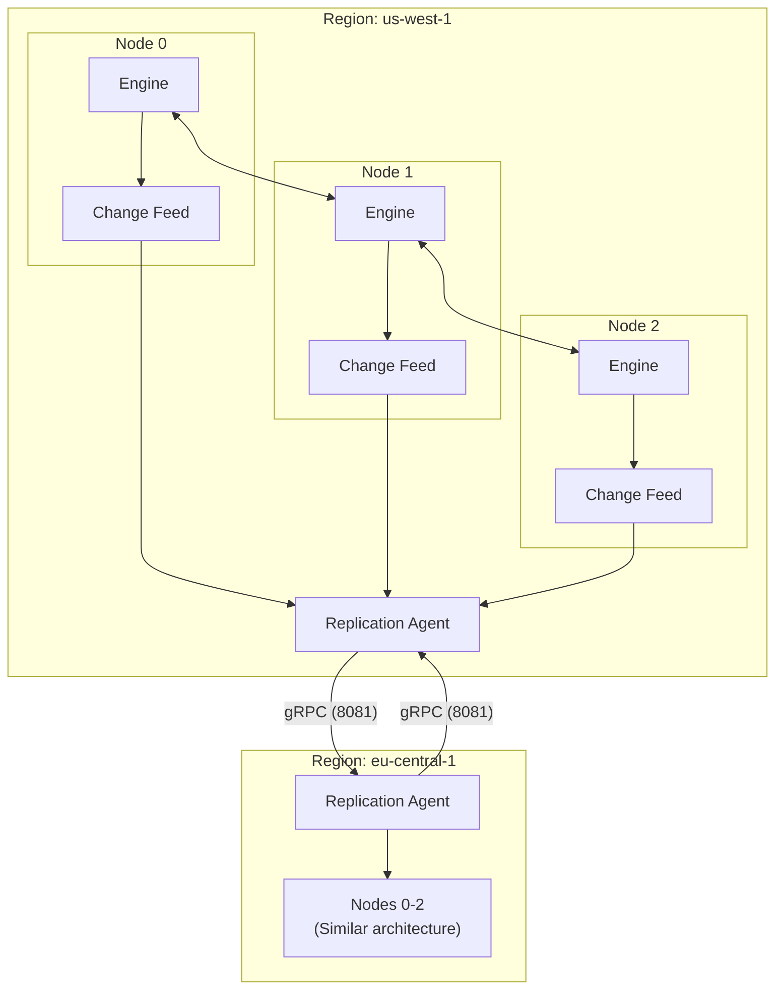
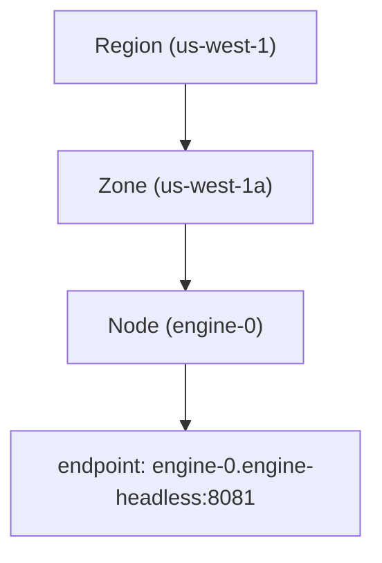
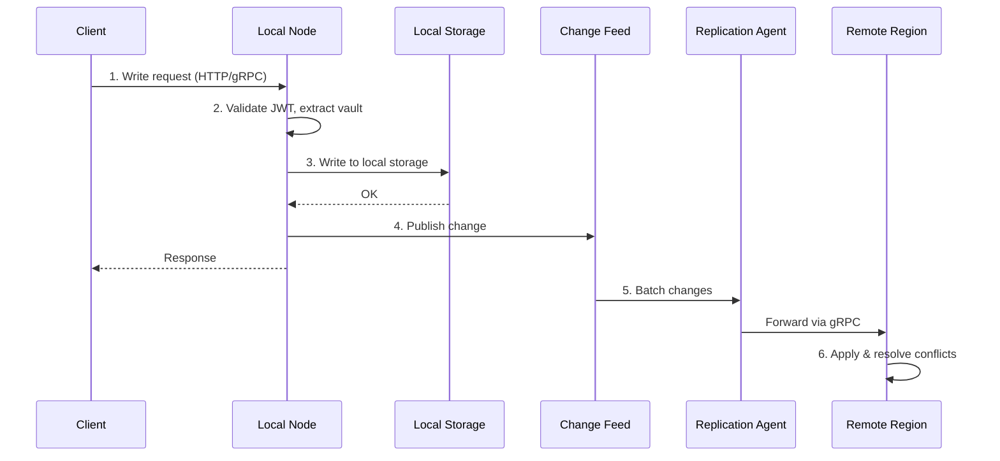
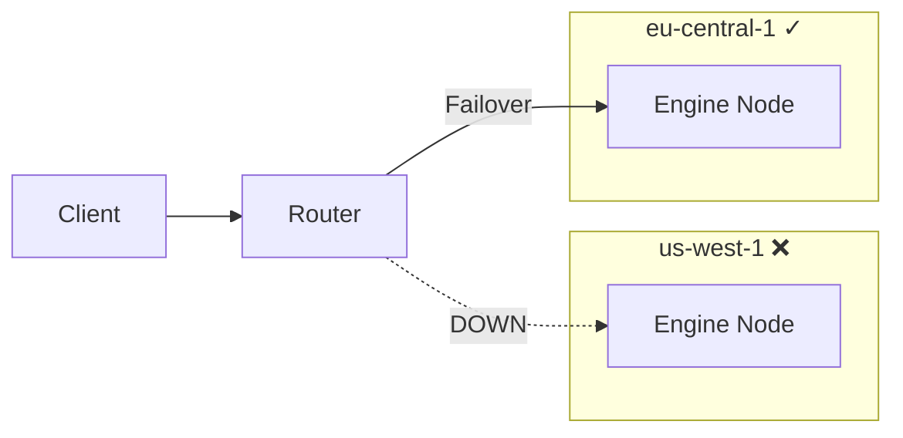
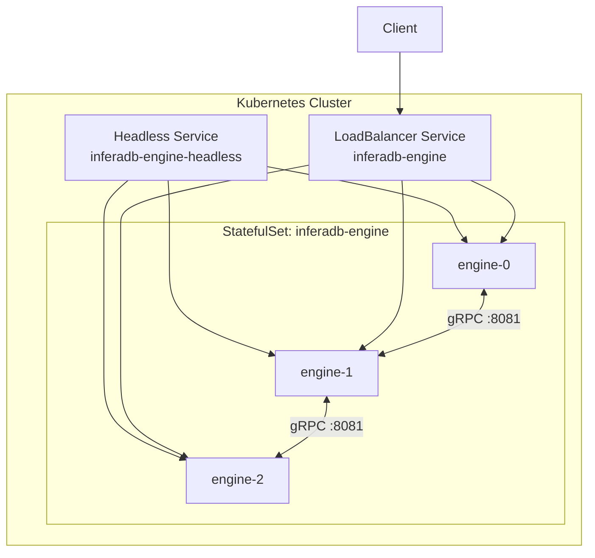
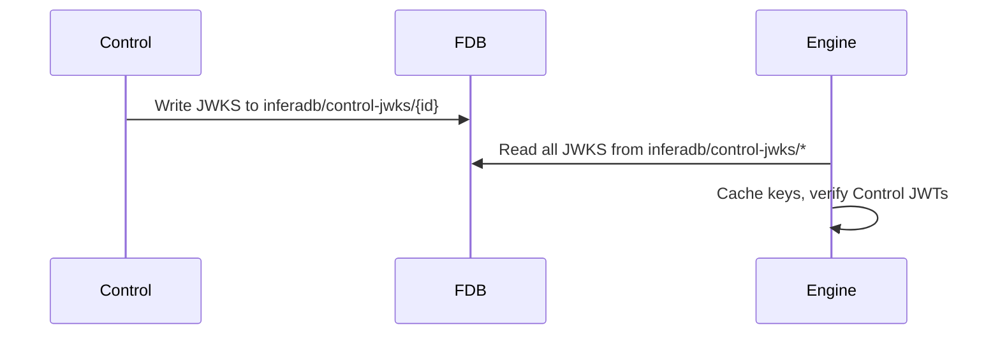
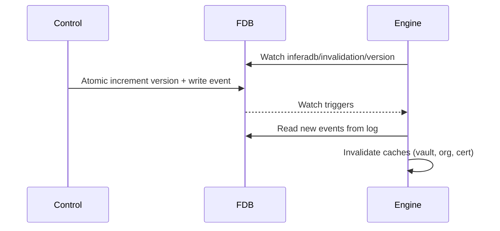

# Distributed Architecture

InferaDB Engine operates as a distributed authorization system with multi-region replication, service discovery, and automatic failover.

## Quick Reference

| Component | Port | Purpose                             |
| --------- | ---- | ----------------------------------- |
| HTTP API  | 8080 | Client requests, Prometheus metrics |
| gRPC API  | 8081 | Inter-node replication, streaming   |
| Mesh API  | 8082 | Control plane communication         |

## System Overview



## Core Components

### 1. Replication System

Multi-region data synchronization is handled by FoundationDB's native Fearless DR.
See [Multi-Region Deployment](../deployment/foundationdb-multi-region.md) for details.

**Topology Hierarchy:**



**Replication Strategies:**

| Strategy         | Reads | Writes              | Use Case           |
| ---------------- | ----- | ------------------- | ------------------ |
| `ActiveActive`   | Local | Local               | Global low-latency |
| `PrimaryReplica` | Local | Primary only        | Strong consistency |
| `MultiMaster`    | Local | Local (partitioned) | Data sovereignty   |

### 2. Change Feed

All relationship modifications flow through the change feed:

```rust
// Write handler publishes to change feed
change_feed.publish(Change {
    revision: 12345,
    operation: Operation::Insert,
    relationship: Relationship { vault, resource, relation, subject },
    timestamp: Utc::now(),
    metadata: ChangeMetadata { source_region: "us-west-1".into() },
}).await;
```

The replication agent subscribes and forwards changes to remote regions.

### 3. Service Discovery

**Kubernetes Mode:**

Resolves service names to pod IPs via Endpoints API.

```yaml
discovery:
  mode: kubernetes
  cache_ttl: 300
  health_check_interval: 30
```

**Tailscale Mode:**

Cross-region discovery via MagicDNS for multi-cloud deployments.

```yaml
discovery:
  mode: tailscale
  tailscale:
    local_cluster: us-west-1
    remote_clusters:
      - name: eu-central-1
        tailscale_domain: eu-central-1.ts.net
        service_name: inferadb-engine
        port: 8081
```

### 4. Region-Aware Router

Routes requests based on operation type and strategy:

```rust
let router = Router::with_strategy(
    topology.clone(),
    LoadBalancingStrategy::RoundRobin,
);

// Reads always route locally
let decision = router.route(RequestType::Read).await?;

// Writes depend on strategy
let decision = router.route(RequestType::Write).await?;
```

**Load Balancing:**

- `RoundRobin` (default): Distributes across healthy nodes
- `FirstAvailable`: Routes to first healthy node

## Inter-Node Communication

### gRPC Replication Protocol

Nodes communicate via gRPC for replication:

```protobuf
service InferadbService {
  rpc Write(WriteRequest) returns (WriteResponse);
  rpc Delete(DeleteRequest) returns (DeleteResponse);
  rpc Watch(WatchRequest) returns (stream WatchResponse);
}
```

**Connection Management:**

- Client caching per target node
- Automatic reconnection on failure
- Configurable request timeout (default: 10s)

### Request Flow



## Consistency Model

### Revision Tokens

Clients can request evaluation at a specific revision for snapshot consistency:

```http
POST /v1/evaluate
{
  "subject": "user:alice",
  "resource": "document:1",
  "permission": "read",
  "revision_token": "abc123..."
}
```

### Conflict Resolution

When concurrent writes conflict:

| Strategy         | Resolution                 |
| ---------------- | -------------------------- |
| `LastWriteWins`  | Latest timestamp wins      |
| `SourcePriority` | Configured region priority |
| `InsertWins`     | Inserts beat deletes       |

## Failover

### Node-Level

```rust
// TopologyManager tracks node health
manager.update_node_status(
    &RegionId::new("us-west-1"),
    &ZoneId::new("us-west-1a"),
    &NodeId::new("engine-0"),
    NodeStatus::Unreachable,
).await;

// Stale node detection (no heartbeat in 30s)
manager.check_stale_nodes(30_000).await;
```

### Region-Level

Router automatically fails over when local region unavailable:



```rust
// If us-west-1 is down, routes to eu-central-1
let decision = router.route(RequestType::Read).await?;
// decision.region_id = "eu-central-1"
```

### Retry Logic

Replication agent retries with exponential backoff:

```yaml
replication:
  agent:
    max_retries: 5
    retry_delay_ms: 100 # 100ms, 200ms, 400ms, 800ms, 1600ms
    batch_size: 100
```

## Configuration

### Minimal Distributed Setup

```yaml
replication:
  enabled: true
  strategy: ActiveActive
  local_region: us-west-1
  conflict_resolution: LastWriteWins

  regions:
    - id: us-west-1
      name: US West
      zones:
        - id: us-west-1a
          nodes:
            - id: engine-0
              endpoint: engine-us-west:8081

    - id: eu-central-1
      name: EU Central
      zones:
        - id: eu-central-1a
          nodes:
            - id: engine-eu-0
              endpoint: engine-eu:8081

  replication_targets:
    us-west-1: [eu-central-1]
    eu-central-1: [us-west-1]
```

### Environment Variables

```bash
INFERADB__REPLICATION__ENABLED=true
INFERADB__REPLICATION__STRATEGY=active_active
INFERADB__REPLICATION__LOCAL_REGION=us-west-1
INFERADB__REPLICATION__AGENT__MAX_RETRIES=5
INFERADB__REPLICATION__AGENT__BATCH_SIZE=100
```

## Kubernetes Deployment



### StatefulSet for Stable Node IDs

```yaml
apiVersion: apps/v1
kind: StatefulSet
metadata:
  name: inferadb-engine
spec:
  serviceName: inferadb-engine-headless
  replicas: 3
  template:
    spec:
      containers:
        - name: engine
          env:
            - name: INFERADB__ENGINE__NODE_ID
              valueFrom:
                fieldRef:
                  fieldPath: metadata.name
```

### Headless Service

```yaml
apiVersion: v1
kind: Service
metadata:
  name: inferadb-engine-headless
spec:
  clusterIP: None
  selector:
    app.kubernetes.io/name: inferadb-engine
  ports:
    - port: 8081
      name: grpc
```

### Pod Anti-Affinity

Spread pods across failure domains:

```yaml
affinity:
  podAntiAffinity:
    preferredDuringSchedulingIgnoredDuringExecution:
      - weight: 100
        podAffinityTerm:
          topologyKey: kubernetes.io/hostname
```

## Monitoring

### Health Endpoint

```http
GET /healthz
```

```json
{
  "status": "healthy",
  "details": {
    "replication": {
      "status": "healthy",
      "enabled": true,
      "published": 12345,
      "subscribers": 2,
      "dropped": 0
    }
  }
}
```

### Prometheus Metrics

| Metric                                          | Type    | Description        |
| ----------------------------------------------- | ------- | ------------------ |
| `inferadb_engine_replication_changes_total`     | Counter | Changes replicated |
| `inferadb_engine_replication_lag_milliseconds`  | Gauge   | Current lag        |
| `inferadb_engine_replication_targets_connected` | Gauge   | Healthy targets    |
| `inferadb_engine_replication_conflicts_total`   | Counter | Conflicts detected |

### Key Alerts

```yaml
# High replication lag
- alert: ReplicationLagHigh
  expr: inferadb_engine_replication_lag_milliseconds > 1000
  for: 5m

# Targets disconnected
- alert: ReplicationTargetDown
  expr: inferadb_engine_replication_targets_connected < inferadb_engine_replication_targets_total
  for: 2m
```

## Control Plane Communication

Engine instances communicate with the Control plane via FDB, eliminating HTTP dependencies and enabling true multi-region support.

### FDB Keyspace

```text
inferadb/
├── control-jwks/{control_id}     # Control JWKS (public keys)
├── invalidation/version          # Atomic version counter (watch trigger)
└── invalidation-log/{ts}:{id}    # Invalidation event log
```

### JWKS Discovery

Control instances publish their JWKS to FDB on startup. Engine reads JWKS directly from FDB instead of HTTP:



### Cache Invalidation

Control writes invalidation events to FDB when data changes. Engine watches for version changes:



**Event Types:**

| Event | Description |
|-------|-------------|
| `Vault` | Invalidate caches for specific vault |
| `Organization` | Invalidate organization lookup cache |
| `Certificate` | Invalidate specific client certificate |
| `All` | Nuclear option - clear all caches |

### Benefits

- **Multi-region**: FDB Fearless DR replicates JWKS and events automatically
- **No HTTP between services**: Control and Engine only need FDB connectivity
- **Near-instant invalidation**: FDB watch is faster than HTTP webhooks
- **Atomic operations**: Events and version counter updated in single transaction

## Related Documentation

- [Replication Operations](../operations/replication.md) - Detailed replication guide
- [Multi-Tenancy](multi-tenancy.md) - Vault isolation
- [Authentication](../authentication.md) - JWT and vault extraction
- [Multi-Region FDB](../deployment/foundationdb-multi-region.md) - FDB deployment for multi-region
