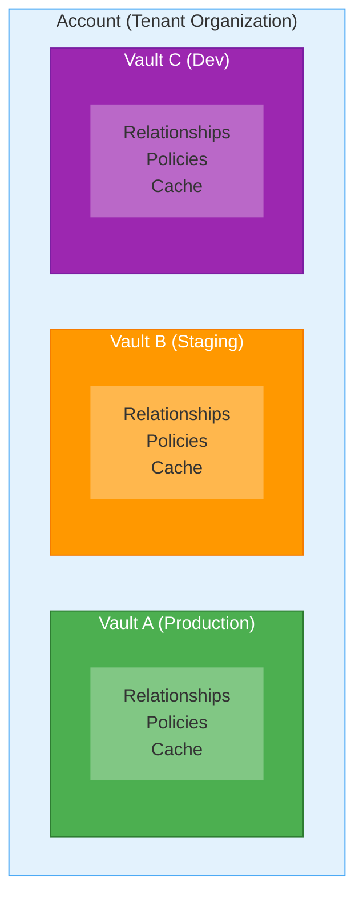
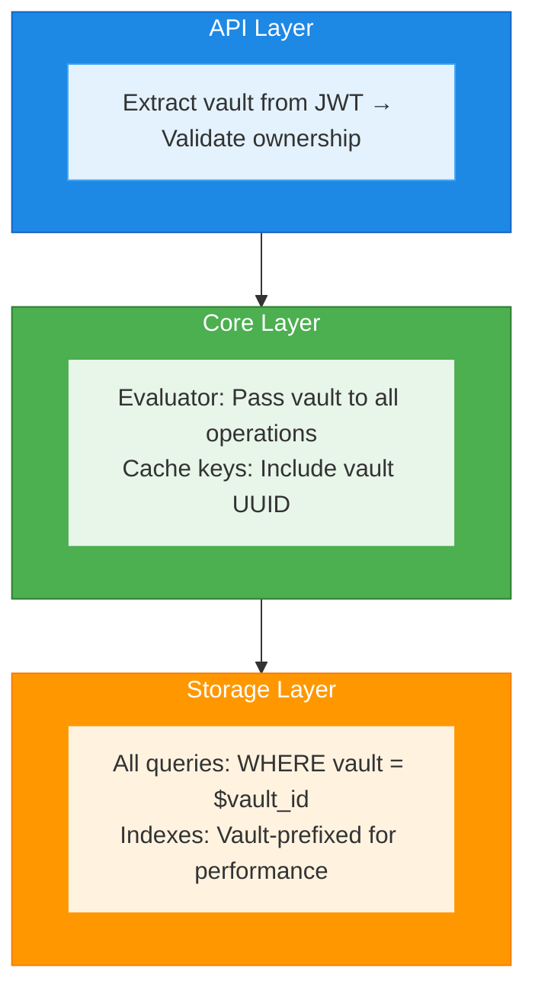
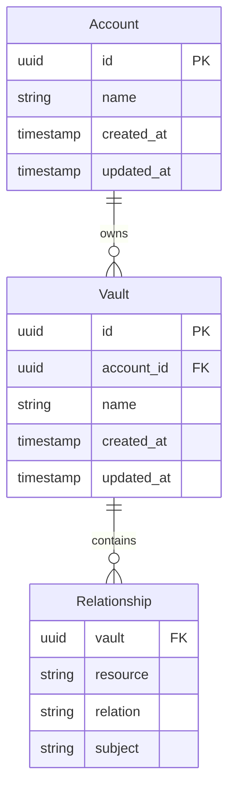

# Multi-Tenancy Architecture

**Last Updated**: 2025-11-02

---

## Table of Contents

1. [Overview](#overview)
2. [Core Concepts](#core-concepts)
3. [Architecture](#architecture)
4. [Data Model](#data-model)
5. [Vault Lifecycle](#vault-lifecycle)
6. [Security Model](#security-model)
7. [Performance Considerations](#performance-considerations)
8. [API Integration](#api-integration)
9. [Best Practices](#best-practices)
10. [Troubleshooting](#troubleshooting)

---

## Overview

InferaDB implements a comprehensive multi-tenancy system using **Accounts** and **Vaults** to provide complete data isolation. This architecture ensures that authorization data (relationships, policies, and evaluation results) are strictly scoped to individual Vaults, with Accounts owning one or more Vaults.

### Key Benefits

- **Complete Data Isolation**: No data leakage between vaults
- **Scalable Multi-Tenancy**: Support for unlimited tenants
- **Flexible Organization**: Accounts can manage multiple vaults
- **Security by Design**: Vault boundaries enforced at every layer
- **Performance Isolation**: Cache and query performance isolated per vault

### Architecture Diagram



---

## Core Concepts

### Account

An **Account** represents a tenant organization or top-level entity in InferaDB. Each account:

- Has a unique UUID identifier
- Has a human-readable name
- Owns zero, one, or many Vaults
- Is the billing/administrative entity
- Cannot access other Accounts' Vaults

**Example Use Cases**:

- One account per company in a B2B SaaS
- One account per department in an enterprise
- One account per team in a multi-team organization

### Vault

A **Vault** is an isolated namespace for authorization data. Each vault:

- Has a unique UUID identifier
- Belongs to exactly one Account
- Contains its own set of Relationships
- Has its own cache namespace
- Maintains independent revision history
- Provides complete data isolation

**Example Use Cases**:

- Production vs. staging environments
- Separate data per customer/client
- Compliance-driven data segregation
- Geographic data residency requirements

### Relationship

A **Relationship** is a tuple that defines access control. Each relationship:

```rust
pub struct Relationship {
    pub vault: Uuid,        // Which vault this belongs to
    pub resource: String,   // The resource (e.g., "document:readme")
    pub relation: String,   // The relation (e.g., "viewer")
    pub subject: String,    // The subject (e.g., "user:alice")
}
```

**Critical**: The `vault` field ensures every relationship is scoped to a specific vault.

---

## Architecture

### Layer Overview

InferaDB enforces vault isolation at every architectural layer:



### 1. API Layer

**Vault Extraction**:

```rust
// From JWT claims
let auth_context = extract_auth(request)?;
let vault = auth_context.vault;

// Or fallback to default vault
let vault = auth.as_ref()
    .map(|ctx| ctx.vault)
    .unwrap_or(state.default_vault);
```

**Vault Validation**:

```rust
// Ensure vault exists and account owns it
inferadb_auth::validate_vault_access_with_store(
    &auth_context,
    &state.store,
).await?;
```

### 2. Core Layer

**Evaluator**:

```rust
pub struct Evaluator {
    vault: Uuid,  // Every evaluator bound to one vault
    store: Arc<dyn RelationshipStore>,
    cache: Option<Arc<AuthCache>>,
    schema: Arc<Schema>,
}

impl Evaluator {
    pub async fn check(&self, request: EvaluateRequest) -> Result<Decision> {
        // All operations use self.vault
        let cache_key = CheckCacheKey::new(
            self.vault,  // Vault-scoped cache key
            request.subject,
            request.resource,
            request.permission,
            revision,
        );
        // ...
    }
}
```

**Cache Isolation**:

```rust
#[derive(Hash, Eq, PartialEq)]
pub struct CheckCacheKey {
    pub vault: Uuid,      // CRITICAL: Prevents cross-vault leakage
    pub subject: String,
    pub resource: String,
    pub permission: String,
    pub revision: Revision,
}
```

### 3. Storage Layer

**Vault-Scoped Queries**:

```rust
// All storage operations include vault parameter
pub trait RelationshipStore {
    async fn write(&self, vault: Uuid, relationships: Vec<Relationship>)
        -> Result<Revision>;

    async fn read(&self, vault: Uuid, key: &RelationshipKey, revision: Revision)
        -> Result<Vec<Relationship>>;

    async fn delete(&self, vault: Uuid, key: &RelationshipKey)
        -> Result<Revision>;
}
```

**Database Schema** (FoundationDB):

```text
Key Pattern:
  /vault/{vault_id}/rel/{resource}/{relation}/{subject}

Indexes:
  /vault/{vault_id}/idx/resource/{resource}
  /vault/{vault_id}/idx/subject/{subject}
  /vault/{vault_id}/revision
```

---

## Data Model

### Entity Relationships



### Vault Ownership Rules

1. **One-to-Many**: An Account can own multiple Vaults
2. **Exclusive Ownership**: Each Vault belongs to exactly one Account
3. **No Sharing**: Accounts cannot access other Accounts' Vaults
4. **Immutable Association**: Vault-Account relationship cannot be changed after creation

---

## Vault Lifecycle

### 1. Creation

**Via API**:

```bash
POST /v1/accounts/{account_id}/vaults
Authorization: Bearer <token>
Content-Type: application/json

{
  "name": "Production Vault"
}
```

**Response**:

```json
{
  "id": "a1b2c3d4-e5f6-4a7b-8c9d-0e1f2a3b4c5d",
  "account_id": "1a2b3c4d-5e6f-7a8b-9c0d-1e2f3a4b5c6d",
  "name": "Production Vault",
  "created_at": "2025-11-02T10:00:00Z",
  "updated_at": "2025-11-02T10:00:00Z"
}
```

**Programmatically**:

```rust
use inferadb_types::Vault;
use uuid::Uuid;

let account_id = Uuid::new_v4();
let vault = Vault::new(account_id, "Production Vault".to_string());

store.create_vault(vault).await?;
```

### 2. Usage

Once created, all API operations automatically scope to the vault specified in the JWT:

```rust
// JWT includes vault claim
{
  "sub": "user:alice",
  "vault": "a1b2c3d4-e5f6-4a7b-8c9d-0e1f2a3b4c5d",
  "account": "1a2b3c4d-5e6f-7a8b-9c0d-1e2f3a4b5c6d",
  "scopes": ["inferadb.read", "inferadb.write"]
}
```

### 3. Management

**List Vaults for Account**:

```bash
GET /v1/accounts/{account_id}/vaults
Authorization: Bearer <admin_token>
```

**Update Vault**:

```bash
PATCH /v1/vaults/{vault_id}
Authorization: Bearer <admin_token>

{
  "name": "Production Vault (Updated)"
}
```

### 4. Deletion

**Delete Vault** (with cascade):

```bash
DELETE /v1/vaults/{vault_id}
Authorization: Bearer <admin_token>
```

⚠️ **Warning**: Deleting a vault will:

1. Delete all relationships in that vault
2. Invalidate all cached data for that vault
3. Make the vault ID unusable
4. **Cannot be undone**

**Best Practice**: Implement soft-delete or require confirmation for production vaults.

---

## Security Model

### JWT Vault Binding

Every access token **must** include vault and account claims:

```json
{
  "sub": "user:alice",
  "iss": "https://auth.example.com",
  "aud": ["inferadb"],
  "exp": 1730563200,
  "iat": 1730559600,
  "vault": "a1b2c3d4-e5f6-4a7b-8c9d-0e1f2a3b4c5d",
  "account": "1a2b3c4d-5e6f-7a8b-9c0d-1e2f3a4b5c6d",
  "scopes": ["inferadb.read", "inferadb.write"]
}
```

### Vault Access Validation

**Three-Level Validation**:

1. **Basic Validation** (always performed):

   ```rust
   inferadb_auth::validate_vault_access(&auth_context)?;
   // Checks: vault != Uuid::nil() && account != Uuid::nil()
   ```

2. **Existence Check** (recommended):

   ```rust
   inferadb_auth::validate_vault_access_with_store(&auth_context, &store).await?;
   // Checks: vault exists in database
   ```

3. **Ownership Verification** (recommended):

   ```rust
   // Automatically performed in validate_vault_access_with_store
   // Checks: vault.account_id == auth_context.account
   ```

### Cross-Vault Operation Prevention

**Storage Layer**:

- All queries include `WHERE vault = ?` clause
- Impossible to query across vaults in single operation
- Database indexes enforce separation

**Cache Layer**:

- Cache keys include vault UUID
- No way to retrieve another vault's cached data
- Invalidation operations are vault-scoped

**API Layer**:

- Vault extracted from authenticated user's token
- No way to specify vault in request body/query params
- Admin operations require special scope + ownership check

---

## Performance Considerations

### Vault-Scoped Indexing

**Benefit**: Queries within a vault are fast because indexes are vault-prefixed.

**Trade-off**: Cross-vault analytics require separate queries per vault.

**Recommendation**: Design your vault strategy based on query patterns:

- **Many small vaults**: Better isolation, slightly higher overhead
- **Few large vaults**: Lower overhead, but less isolation granularity

### Cache Isolation Overhead

**Memory Impact**:

- Each vault has its own cache namespace
- 100 vaults × 10MB cache = 1GB total
- Monitor memory usage and adjust cache size per deployment

**Cache Hit Rates**:

- Vault-scoped caching means no cache sharing between vaults
- Each vault "warms up" its own cache independently
- Consider pre-warming caches for frequently accessed vaults

### Query Performance with Vault Filtering

**FoundationDB Storage**:

- Vault filtering adds minimal overhead (~1-2%)
- Indexes are vault-prefixed for optimal performance
- Revision tracking is per-vault (better locality)

**Benchmarks** (1M relationships, 100 vaults):

- Single-vault query: ~1.2ms avg
- Cross-vault query: Not supported (by design)
- List all vaults: ~15ms (admin operation)

### Scaling Multi-Tenant Deployments

**Horizontal Scaling**:

- Stateless API servers can handle any vault
- FoundationDB provides distributed storage
- Cache isolation prevents cross-tenant interference

**Vertical Scaling**:

- More RAM = larger per-vault caches
- More CPU cores = higher concurrent vault operations
- Recommend: 4GB RAM per 100 vaults (with 10MB cache each)

**Sharding Strategy** (if needed):

- Shard by Account ID for admin operations
- Shard by Vault ID for data operations
- No cross-shard queries required (vault boundaries align with shards)

---

## API Integration

### REST API

**Write Relationships**:

```bash
POST /v1/relationships/write
Authorization: Bearer <token>  # includes vault claim
Content-Type: application/json

{
  "relationships": [
    {
      "resource": "document:readme",
      "relation": "viewer",
      "subject": "user:alice"
    }
  ]
}
```

**Note**: The `vault` field is automatically added based on the JWT token.

**Check Permission**:

```bash
POST /v1/evaluate
Authorization: Bearer <token>

{
  "evaluations": [
    {
      "subject": "user:alice",
      "resource": "document:readme",
      "permission": "view"
    }
  ]
}
```

### gRPC API

**Metadata Propagation**:

```go
// Go client example
md := metadata.Pairs("authorization", "Bearer "+token)
ctx := metadata.NewOutgoingContext(context.Background(), md)

response, err := client.Check(ctx, &pb.EvaluateRequest{
    Subject:    "user:alice",
    Resource:   "document:readme",
    Permission: "view",
})
```

The vault is extracted from the JWT token in the authorization header.

### Authentication Integration

**JWKS Configuration**:

```yaml
auth:
  enabled: true
  jwks_url: "https://auth.example.com/.well-known/jwks.json"
  required_audience: "inferadb"
  required_issuer: "https://auth.example.com"
```

**Token Generation** (example with Auth0):

```javascript
const token = await auth0.getAccessToken({
  audience: "inferadb",
  scope: "inferadb.read inferadb.write",
  claims: {
    vault: "a1b2c3d4-e5f6-4a7b-8c9d-0e1f2a3b4c5d",
    account: "1a2b3c4d-5e6f-7a8b-9c0d-1e2f3a4b5c6d",
  },
});
```

---

## Best Practices

### 1. Vault Organization

**✅ Do**:

- Create separate vaults for production, staging, and development
- Use one vault per customer in B2B SaaS scenarios
- Name vaults descriptively (e.g., "Acme Corp - Production")
- Document vault ownership and purpose

**❌ Don't**:

- Share a single vault across multiple customers
- Create too many vaults (>1000 per account) without good reason
- Use vault IDs directly in application logic (use names/metadata)

### 2. Token Management

**✅ Do**:

- Always include both `vault` and `account` claims in JWTs
- Use short-lived tokens (1 hour recommended)
- Implement token refresh mechanisms
- Validate vault ownership on every request

**❌ Don't**:

- Use Uuid::nil() for vault/account in production
- Hardcode vault IDs in application code
- Skip vault validation for "internal" requests
- Allow users to specify vault in request body

### 3. Performance Optimization

**✅ Do**:

- Enable caching for frequently accessed data
- Monitor cache hit rates per vault
- Use batch operations when possible
- Pre-warm caches for critical vaults

**❌ Don't**:

- Disable vault filtering for "performance"
- Query all vaults in a loop (use proper account-level APIs)
- Set cache TTL too high (recommend: 5 minutes)
- Ignore memory usage of vault-scoped caches

### 4. Security

**✅ Do**:

- Always validate vault ownership before operations
- Audit vault access patterns
- Implement rate limiting per vault
- Log vault ID in all access logs

**❌ Don't**:

- Allow vault switching via API parameters
- Trust client-provided vault IDs
- Skip validation for "admin" requests without proper scoping
- Store sensitive data in vault names

---

## Troubleshooting

### Common Issues

#### 1. "Vault access denied" Error

**Symptom**: API returns 403 Forbidden with "Vault access denied"

**Causes**:

- JWT missing `vault` claim
- JWT has `vault` set to Uuid::nil()
- Vault doesn't exist in database
- Vault doesn't belong to the account in JWT

**Solutions**:

```bash
# Verify JWT claims
echo $TOKEN | cut -d. -f2 | base64 -d | jq .

# Check vault exists
curl -H "Authorization: Bearer $ADMIN_TOKEN" \
  https://api.example.com/v1/vaults/$VAULT_ID

# Verify ownership
curl -H "Authorization: Bearer $ADMIN_TOKEN" \
  https://api.example.com/v1/accounts/$ACCOUNT_ID/vaults
```

#### 2. Data Not Found After Write

**Symptom**: Write succeeds but read returns empty

**Causes**:

- Reading from wrong vault
- JWT vault claim differs between write and read requests
- Cache not invalidated properly

**Solutions**:

```bash
# Verify same vault used
echo "Write token vault:"; echo $WRITE_TOKEN | cut -d. -f2 | base64 -d | jq .vault
echo "Read token vault:"; echo $READ_TOKEN | cut -d. -f2 | base64 -d | jq .vault

# Force cache invalidation
curl -X POST -H "Authorization: Bearer $TOKEN" \
  https://api.example.com/v1/cache/invalidate
```

#### 3. Cache Hit Rate Low

**Symptom**: High latency despite caching enabled

**Causes**:

- Too many vaults sharing limited cache memory
- Cache TTL too short
- Frequent writes causing invalidation

**Solutions**:

```yaml
# Increase cache size per vault
cache:
  max_entries: 20000 # Up from 10000
  ttl_seconds: 600 # Up from 300

# Or reduce number of vaults
# Consolidate similar use cases into shared vaults
```

#### 4. Performance Degradation with Many Vaults

**Symptom**: Slower queries as vault count increases

**Causes**:

- Memory pressure from vault-scoped caches
- Too many concurrent connections
- Inefficient vault organization

**Solutions**:

```bash
# Monitor memory usage
curl https://api.example.com/metrics | grep cache_memory

# Consolidate vaults if possible
# Consider hierarchical organization (accounts → vaults)

# Increase resources
# Recommended: 4GB RAM per 100 vaults
```

---

## Additional Resources

- [API Reference](/api/rest.md) - Complete REST API documentation
- [gRPC Reference](/api/grpc.md) - gRPC service definitions
- [Deployment Guide](/docs/deployment/multi-tenant.md) - Production deployment
- [Configuration](/docs/configuration.md) - Multi-tenancy config options
- [Security](/SECURITY.md) - Security best practices

---

## Support

For questions or issues:

- GitHub Issues: <https://github.com/anthropics/inferadb/issues>
- Documentation: <https://docs.infera.dev>
- Email: <support@infera.dev>
