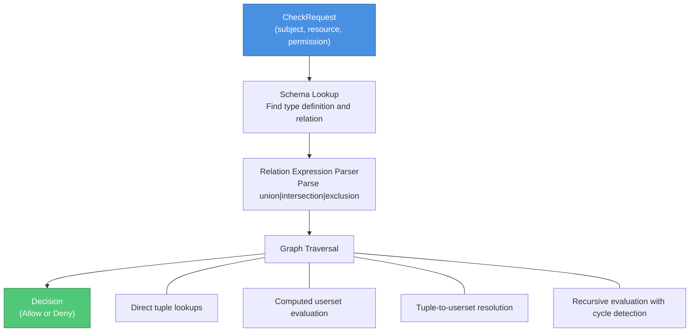
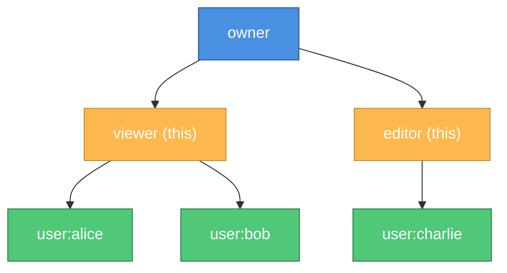

# Evaluation Engine

The InferaDB evaluation engine is the core component responsible for making authorization decisions. It evaluates IPL policy definitions against stored relationship tuples to determine whether a subject has permission to perform an action on a resource.

## Overview

The evaluation engine implements a graph-based algorithm that:

1. Parses the permission request
2. Looks up the relevant policy definition
3. Traverses the relationship graph
4. Evaluates set operations (union, intersection, exclusion)
5. Returns an allow/deny decision with optional trace

## Architecture



## Core Components

### 1. Evaluator

The `Evaluator` is the main entry point for authorization checks.

**Location**: [`crates/infera-core/src/evaluator.rs`](../crates/infera-core/src/evaluator.rs)

**Key Methods**:

```rust
impl Evaluator {
    /// Check if a subject has permission on a resource
    pub async fn check(&self, request: CheckRequest) -> Result<Decision>;

    /// Check with detailed trace for debugging
    pub async fn check_with_trace(&self, request: CheckRequest) -> Result<(Decision, DecisionTrace)>;

    /// Expand a relation into a userset tree
    pub async fn expand(&self, request: ExpandRequest) -> Result<UsersetTree>;
}
```

### 2. Graph Traversal

The graph traversal engine evaluates relation expressions by walking the relationship graph.

**Location**: [`crates/infera-core/src/graph.rs`](../crates/infera-core/src/graph.rs)

**Key Concepts**:

- **Direct Lookup**: Check if a tuple exists directly in the store
- **Computed Userset**: Evaluate another relation on the same resource
- **Tuple-to-Userset**: Follow a relation to find intermediate resources, then evaluate another relation on those
- **Cycle Detection**: Prevent infinite loops in circular relationship graphs

### 3. Relation Expressions

InferaDB supports several types of relation expressions:

#### This (Direct Assignment)

The simplest form - check if the tuple exists directly.

```ipl
type document {
  relation viewer
}
```

Evaluation:

1. Look up tuple `(document:readme, viewer, user:alice)`
2. If exists, return Allow; otherwise Deny

**Wildcard Users**:

InferaDB supports wildcard users (`user:*`) to grant access to all users:

```ipl
type document {
  relation public_viewer
}
```

**Example**:

```bash
# Grant public access to a document
write_tuple("doc:readme", "public_viewer", "user:*")

# Any user can now access it
check("user:alice", "doc:readme", "public_viewer")  # Allow
check("user:bob", "doc:readme", "public_viewer")    # Allow
check("user:anyone", "doc:readme", "public_viewer") # Allow
```

**Use Cases**:

- Public documents accessible to everyone
- Organization-wide resources
- Default permissions for all authenticated users

**Note**: The wildcard applies to any subject starting with `user:`. For type-specific wildcards, use separate relations (e.g., `group:*` for all groups).

#### Union (OR)

Any of the sub-relations grants access.

```ipl
type document {
  relation viewer
  relation editor
  relation owner = viewer | editor  // union
}
```

Evaluation:

1. Evaluate `viewer` relation
2. If Allow, return Allow
3. Otherwise, evaluate `editor` relation
4. Return result

**Short-circuit optimization**: Stops at first Allow.

#### Intersection (AND)

All sub-relations must grant access.

```ipl
type document {
  relation approver
  relation editor
  relation can_publish = approver & editor  // intersection
}
```

Evaluation:

1. Evaluate `approver` relation
2. If Deny, return Deny (short-circuit)
3. Evaluate `editor` relation
4. Return result

**Short-circuit optimization**: Stops at first Deny.

#### Exclusion (EXCEPT)

First relation grants access, second relation revokes it.

```ipl
type document {
  relation viewer
  relation blocked
  relation can_view = viewer - blocked  // exclusion
}
```

Evaluation:

1. Evaluate `viewer` relation
2. If Deny, return Deny (no access to revoke)
3. Evaluate `blocked` relation
4. If Allow (is blocked), return Deny
5. Return Allow

#### Computed Userset (Relation Reference)

Evaluate a different relation on the same resource.

```ipl
type document {
  relation editor
  relation viewer = editor  // computed userset
}
```

Evaluation:

1. Parse relation reference `editor`
2. Recursively evaluate `editor` relation on same resource
3. Return result

#### Tuple-to-Userset (Indirect Relation)

Follow a relation to find intermediate resources, then evaluate another relation on those resources.

```ipl
type document {
  relation parent: folder
  relation viewer = viewer from parent  // tuple-to-userset
}
```

Evaluation:

1. Look up tuples `(document:readme, parent, ?)`
2. For each result (e.g., `folder:shared`):
    - Evaluate `viewer` relation on that resource
    - Check if subject has `viewer` on `folder:shared`
3. Return Allow if any intermediate check succeeds

## Evaluation Algorithm

### Basic Check Algorithm

```rust
fn check(subject: &str, resource: &str, permission: &str) -> Decision {
    // 1. Look up schema
    let type_def = schema.get_type(resource.type_name());
    let relation = type_def.get_relation(permission);

    // 2. Evaluate relation expression
    match relation.expression {
        This => {
            // Direct tuple lookup
            if store.exists(resource, permission, subject) {
                Allow
            } else {
                Deny
            }
        }
        Union(exprs) => {
            // Short-circuit OR
            for expr in exprs {
                if eval_expr(expr) == Allow {
                    return Allow;
                }
            }
            Deny
        }
        Intersection(exprs) => {
            // Short-circuit AND
            for expr in exprs {
                if eval_expr(expr) == Deny {
                    return Deny;
                }
            }
            Allow
        }
        Exclusion(base, subtract) => {
            // Base grants, subtract revokes
            if eval_expr(base) == Deny {
                return Deny;
            }
            if eval_expr(subtract) == Allow {
                return Deny;
            }
            Allow
        }
        ComputedUserset(relation) => {
            // Recursive evaluation
            check(subject, resource, relation)
        }
        TupleToUserset(tupleset, computed) => {
            // Follow relation chain
            let intermediates = store.read(resource, tupleset);
            for intermediate in intermediates {
                if check(subject, intermediate, computed) == Allow {
                    return Allow;
                }
            }
            Deny
        }
    }
}
```

### Cycle Detection

To prevent infinite loops in circular relationship graphs, the evaluator tracks visited nodes:

```rust
struct EvaluationContext {
    visited: HashSet<(String, String, String)>,  // (resource, relation, subject)
    max_depth: usize,
}

fn check_with_context(ctx: &mut EvaluationContext, ...) -> Decision {
    let key = (resource.clone(), relation.clone(), subject.clone());

    // Detect cycles
    if ctx.visited.contains(&key) {
        return Deny;  // Prevent infinite recursion
    }

    // Check depth limit
    if ctx.visited.len() >= ctx.max_depth {
        return Deny;  // Prevent stack overflow
    }

    ctx.visited.insert(key);
    let result = eval_relation(...);
    ctx.visited.remove(&key);

    result
}
```

## Decision Tracing

For debugging and auditing, the evaluator can produce a detailed trace of the evaluation process.

**Example Trace**:

```json
{
    "decision": "allow",
    "root": {
        "node_type": "union",
        "result": true,
        "children": [
            {
                "node_type": "direct_check",
                "result": false,
                "object": "doc:readme",
                "relation": "owner",
                "user": "user:alice"
            },
            {
                "node_type": "computed_userset",
                "result": true,
                "relation": "editor",
                "children": [
                    {
                        "node_type": "direct_check",
                        "result": true,
                        "object": "doc:readme",
                        "relation": "editor",
                        "user": "user:alice"
                    }
                ]
            }
        ]
    },
    "duration_micros": 1234,
    "tuples_read": 5,
    "relations_evaluated": 3
}
```

**Trace Information**:

- **Decision Path**: Tree showing which relations were evaluated
- **Intermediate Results**: Allow/deny at each node
- **Performance Metrics**: Duration, tuples read, relations evaluated
- **Debugging**: Understand why access was granted or denied

## Performance Optimizations

### 1. Caching

The evaluator integrates with the caching layer to cache evaluation results:

```rust
let cache_key = format!("{}/{}/{}/{}", subject, resource, permission, revision);

// Check cache first
if let Some(decision) = cache.get(&cache_key) {
    return decision;
}

// Evaluate and cache result
let decision = eval_relation(...);
cache.insert(cache_key, decision, ttl);
decision
```

**Cache Key**: `{subject}/{resource}/{permission}/{revision}`

**Benefits**:

- Repeated checks are <1ms (cache hit)
- Reduces database load
- Scales horizontally

### 2. Short-Circuit Evaluation

**Union** (OR):

- Stop at first Allow
- Don't evaluate remaining branches

**Intersection** (AND):

- Stop at first Deny
- Don't evaluate remaining branches

**Example**:

```ipl
relation viewer = editor | owner | contributor
```

If `editor` check returns Allow, `owner` and `contributor` are never evaluated.

### 3. Parallel Evaluation

For independent sub-relations, the evaluator can evaluate them in parallel:

```ipl
relation can_access = (owner | editor) & not_blocked
```

Evaluation plan:

1. Evaluate `owner` and `editor` in parallel
2. If both Deny, short-circuit (no need to check `not_blocked`)
3. Otherwise evaluate `not_blocked`

See [Query Optimization](query-optimization.md) for details.

### 4. Batch Tuple Reads

Instead of reading tuples one at a time, the evaluator batches reads:

```rust
// Instead of:
for user in users {
    store.read(resource, relation, user);
}

// Do:
let keys = users.map(|u| (resource, relation, u));
let results = store.batch_read(keys);
```

## Expansion

The `expand` operation builds a userset tree showing all ways to have a relation.

**Example**:

```ipl
type document {
  relation viewer
  relation editor
  relation owner = viewer | editor
}
```

**Expansion of `owner` on `doc:readme`**:



**Algorithm**:

```rust
fn expand(resource: &str, relation: &str) -> UsersetTree {
    let type_def = schema.get_type(resource.type_name());
    let rel_def = type_def.get_relation(relation);

    match rel_def.expression {
        This => {
            // Leaf node: return users with this relation
            let users = store.read(resource, relation, None);
            UsersetTree::Leaf(users)
        }
        Union(exprs) => {
            // Union node: expand all branches
            let children = exprs.map(|e| expand_expr(e));
            UsersetTree::Union(children)
        }
        // ... other expression types
    }
}
```

## Error Handling

The evaluator handles several error conditions:

### Schema Not Found

If the resource type or relation is not defined in the schema:

```rust
Err(EvalError::SchemaNotFound {
    resource_type: "unknown_type",
    relation: "viewer"
})
```

### Max Depth Exceeded

If evaluation exceeds the maximum depth limit:

```rust
Err(EvalError::MaxDepthExceeded {
    depth: 100,
    max_depth: 100
})
```

### Cycle Detected

If a circular relationship is detected:

```rust
Err(EvalError::CycleDetected {
    path: vec![
        ("doc:1", "viewer"),
        ("folder:a", "viewer"),
        ("doc:1", "viewer")  // cycle!
    ]
})
```

### Store Error

If the storage layer returns an error:

```rust
Err(EvalError::Store(StoreError::...))
```

## Testing

The evaluation engine has comprehensive test coverage:

**Unit Tests** ([`crates/infera-core/src/evaluator.rs`](../crates/infera-core/src/evaluator.rs)):

- Direct tuple checks
- Union/intersection/exclusion operations
- Computed usersets
- Tuple-to-userset resolution
- Cycle detection
- Max depth limits

**Integration Tests** ([`crates/infera-core/tests/`](../crates/infera-core/tests/)):

- Document management scenario
- Organization hierarchy scenario
- Role-based access control scenario

**Benchmarks** ([`crates/infera-core/benches/evaluator.rs`](../crates/infera-core/benches/evaluator.rs)):

- Simple checks: <10μs
- Complex nested checks: <100μs
- Deep hierarchies: <1ms

## Configuration

**Default Settings**:

```rust
EvaluatorConfig {
    max_depth: 100,           // Maximum recursion depth
    enable_cache: true,       // Use caching layer
    cache_ttl: 300,           // Cache TTL in seconds (5 minutes)
    enable_tracing: false,    // Detailed trace logging
}
```

## Examples

### Direct Permission Check

```rust
let evaluator = Evaluator::new(store, schema, None);

let request = CheckRequest {
    subject: "user:alice".to_string(),
    resource: "doc:readme".to_string(),
    permission: "viewer".to_string(),
    context: None,
};

let decision = evaluator.check(request).await?;
assert_eq!(decision, Decision::Allow);
```

### Check with Trace

```rust
let request = CheckRequest {
    subject: "user:bob".to_string(),
    resource: "doc:secret".to_string(),
    permission: "viewer".to_string(),
    context: None,
};

let (decision, trace) = evaluator.check_with_trace(request).await?;

println!("Decision: {:?}", decision);
println!("Trace: {:#?}", trace);
println!("Duration: {}μs", trace.duration_micros);
println!("Tuples read: {}", trace.tuples_read);
```

### Expand Relation

```rust
let request = ExpandRequest {
    resource: "doc:readme".to_string(),
    relation: "owner".to_string(),
};

let tree = evaluator.expand(request).await?;

// tree is a UsersetTree showing all ways to have "owner" relation
println!("Userset tree: {:#?}", tree);
```

## Best Practices

### 1. Keep Relation Graphs Shallow

Deep nesting impacts performance. Aim for 3-5 levels maximum.

**Good**:

```ipl
type document {
  relation parent: folder
  relation viewer = viewer from parent
}
```

**Avoid**:

```ipl
// 10+ levels of nesting
relation viewer = viewer from parent from parent from parent...
```

### 2. Use Union for OR Semantics

Union has short-circuit optimization. Put most common checks first.

```ipl
relation viewer = direct_viewer | editor | owner | admin
                  # ^ Most common first
```

### 3. Cache Aggressively

Enable caching for frequently checked permissions:

```rust
let evaluator = Evaluator::new(store, schema, Some(cache));
```

### 4. Use Tracing for Debugging

Enable tracing during development to understand evaluation:

```rust
let (decision, trace) = evaluator.check_with_trace(request).await?;
```

### 5. Set Reasonable Limits

Configure max depth to prevent abuse:

```rust
let config = EvaluatorConfig {
    max_depth: 50,  // Adjust based on your schema
    ..Default::default()
};
```

## Monitoring

Key metrics to monitor:

- **Check Latency**: p50, p90, p99 latencies
- **Cache Hit Rate**: Percentage of cached results
- **Tuples Read**: Average tuples read per check
- **Relations Evaluated**: Average relations evaluated per check
- **Error Rate**: Percentage of failed checks

See [Observability](../operations/observability/README.md) for details.

## Next Steps

- [IPL Language Guide](ipl.md) - Learn the policy definition language
- [Query Optimization](query-optimization.md) - Optimize complex queries
- [WASM Integration](../advanced/wasm.md) - Add custom logic with WebAssembly
- [Caching System](caching.md) - Configure caching for performance
- [API Reference](../api/rest.md) - Use the evaluation engine via REST/gRPC
