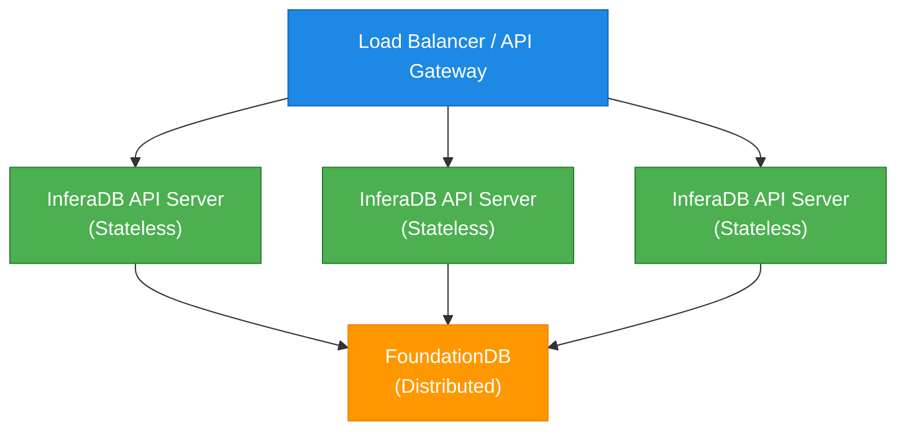

# Multi-Tenant Deployment Guide

**Last Updated**: 2025-11-02
**Audience**: DevOps, Platform Engineers, System Administrators

---

## Table of Contents

1. [Overview](#overview)
2. [When to Use Multi-Tenancy](#when-to-use-multi-tenancy)
3. [Initial Setup](#initial-setup)
4. [JWT Configuration](#jwt-configuration)
5. [Account & Vault Management](#account--vault-management)
6. [Production Best Practices](#production-best-practices)
7. [Monitoring & Observability](#monitoring--observability)
8. [Troubleshooting](#troubleshooting)

---

## Overview

This guide walks you through deploying InferaDB in a multi-tenant configuration using Accounts and Vaults for complete data isolation.

### Deployment Topology



---

## When to Use Multi-Tenancy

### Use Multi-Tenancy When

✅ **You have multiple isolated customers/clients**

- B2B SaaS with per-customer data isolation
- Multi-organization platforms
- Compliance requirements for data separation

✅ **You need environment separation**

- Production vs. staging vs. development
- Multiple deployment regions
- Testing isolation from production

✅ **You have hierarchical organization structures**

- Departments within an enterprise
- Teams within an organization
- Projects within teams

### Use Single Vault When

❌ **You have a single application with one data space**

- Single-tenant SaaS
- Internal tools with unified access control
- Simple authorization scenarios

❌ **You need cross-tenant queries**

- Shared resources across all tenants
- Global analytics
- Cross-tenant collaboration (use alternative patterns)

---

## Initial Setup

### Step 1: Configure Multi-Tenancy

Create or update your `config.yaml`:

```yaml
multi_tenancy:
  enabled: true
  # Optional: Specify default IDs (will be created if they don't exist)
  # default_organization: "1a2b3c4d-5e6f-7a8b-9c0d-1e2f3a4b5c6d"
  # default_vault: "a1b2c3d4-e5f6-4a7b-8c9d-0e1f2a3b4c5d"

auth:
  enabled: true
  jwks_url: "https://your-auth-provider.com/.well-known/jwks.json"
  audience: "inferadb"
  allowed_audiences:
    - "inferadb"
  # Scopes are validated per-endpoint based on JWT's scope claim
  # inferadb.check, inferadb.write, inferadb.read, etc.

server:
  port: 8080
  worker_threads: 8

storage:
  backend: "foundationdb"
  cluster_file: "/etc/foundationdb/fdb.cluster"

cache:
  enabled: true
  max_entries: 10000 # Per vault
  ttl_seconds: 300

observability:
  metrics:
    enabled: true
    port: 9090
  tracing:
    enabled: true
    endpoint: "http://jaeger:4317"
```

### Step 2: Start InferaDB

```bash
# Using Docker
docker run -d \
  --name inferadb \
  -p 8080:8080 \
  -p 9090:9090 \
  -v $(pwd)/config.yaml:/etc/inferadb/config.yaml \
  -v /etc/foundationdb:/etc/foundationdb:ro \
  inferadb/inferadb:latest

# Using systemd
sudo systemctl start inferadb

# Check logs
docker logs -f inferadb
# or
journalctl -u inferadb -f
```

### Step 3: Verify Initialization

On first startup, InferaDB automatically creates a default account and vault:

```bash
# Check logs for initialization messages
grep "Default account created" /var/log/inferadb/inferadb.log
grep "Default vault created" /var/log/inferadb/inferadb.log

# Verify via API (requires admin token)
curl -H "Authorization: Bearer $ADMIN_TOKEN" \
  http://localhost:8080/v1/accounts
```

Expected output:

```json
[
  {
    "id": "...",
    "name": "Default Account",
    "created_at": "2025-11-02T10:00:00Z",
    "updated_at": "2025-11-02T10:00:00Z"
  }
]
```

---

## JWT Configuration

### Overview

InferaDB requires JWTs to include `vault` and `account` claims for multi-tenant isolation.

### Configuring Your Auth Provider

#### Auth0

1. **Create a Custom Action** (Actions → Flows → Login):

```javascript
exports.onExecutePostLogin = async (event, api) => {
  const namespace = "https://inferadb.app";

  // Set vault based on organization or metadata
  const vaultId =
    event.user.app_metadata?.vault_id ||
    event.organization?.id ||
    "default-vault-id";

  const accountId =
    event.user.app_metadata?.account_id ||
    event.organization?.metadata?.account_id ||
    "default-account-id";

  api.accessToken.setCustomClaim(`${namespace}/vault`, vaultId);
  api.accessToken.setCustomClaim(`${namespace}/account`, accountId);
};
```

1. **Test the Token**:

```bash
# Get token
TOKEN=$(curl -X POST https://YOUR_DOMAIN.auth0.com/oauth/token \
  -H 'content-type: application/json' \
  -d '{
    "client_id":"YOUR_CLIENT_ID",
    "client_secret":"YOUR_CLIENT_SECRET",
    "audience":"inferadb",
    "grant_type":"client_credentials"
  }' | jq -r .access_token)

# Decode and verify claims
echo $TOKEN | cut -d. -f2 | base64 -d | jq .
```

#### Keycloak

1. **Create Protocol Mapper** (Clients → YOUR_CLIENT → Mappers):

- Mapper Type: "User Attribute"
- User Attribute: "vault_id"
- Token Claim Name: "vault"
- Claim JSON Type: "String"

1. **Set User Attributes** (Users → YOUR_USER → Attributes):

```text
vault_id = a1b2c3d4-e5f6-4a7b-8c9d-0e1f2a3b4c5d
account_id = 1a2b3c4d-5e6f-7a8b-9c0d-1e2f3a4b5c6d
```

#### Custom OAuth2 Provider

Ensure your token payload includes:

```json
{
  "sub": "user:alice",
  "iss": "https://your-auth-provider.com",
  "aud": ["inferadb"],
  "exp": 1730563200,
  "iat": 1730559600,
  "vault": "a1b2c3d4-e5f6-4a7b-8c9d-0e1f2a3b4c5d",
  "account": "1a2b3c4d-5e6f-7a8b-9c0d-1e2f3a4b5c6d",
  "scopes": ["inferadb.read", "inferadb.write"]
}
```

### JWKS Setup

InferaDB automatically fetches and caches your JWKS:

```yaml
auth:
  jwks_url: "https://your-auth-provider.com/.well-known/jwks.json"
  jwks_cache_ttl: 3600 # 1 hour
  jwks_refresh_interval: 300 # 5 minutes
```

**Supported Algorithms**: Only asymmetric algorithms (EdDSA, RS256, RS384, RS512)

---

## Account & Vault Management

### Creating Accounts

**Via API**:

```bash
POST /v1/accounts
Authorization: Bearer <admin_token>
Content-Type: application/json

{
  "name": "Acme Corporation"
}
```

**Response**:

```json
{
  "id": "1a2b3c4d-5e6f-7a8b-9c0d-1e2f3a4b5c6d",
  "name": "Acme Corporation",
  "created_at": "2025-11-02T10:00:00Z",
  "updated_at": "2025-11-02T10:00:00Z"
}
```

**Required Scope**: `inferadb.admin`

### Creating Vaults

**For a Specific Account**:

```bash
POST /v1/accounts/1a2b3c4d-5e6f-7a8b-9c0d-1e2f3a4b5c6d/vaults
Authorization: Bearer <admin_token>
Content-Type: application/json

{
  "name": "Production Environment"
}
```

**Response**:

```json
{
  "id": "a1b2c3d4-e5f6-4a7b-8c9d-0e1f2a3b4c5d",
  "account_id": "1a2b3c4d-5e6f-7a8b-9c0d-1e2f3a4b5c6d",
  "name": "Production Environment",
  "created_at": "2025-11-02T10:00:00Z",
  "updated_at": "2025-11-02T10:00:00Z"
}
```

### Listing Vaults

**For an Account**:

```bash
GET /v1/accounts/1a2b3c4d-5e6f-7a8b-9c0d-1e2f3a4b5c6d/vaults
Authorization: Bearer <admin_token>
```

**Response**:

```json
[
  {
    "id": "a1b2c3d4-e5f6-4a7b-8c9d-0e1f2a3b4c5d",
    "account_id": "1a2b3c4d-5e6f-7a8b-9c0d-1e2f3a4b5c6d",
    "name": "Production Environment",
    "created_at": "2025-11-02T10:00:00Z",
    "updated_at": "2025-11-02T10:00:00Z"
  },
  {
    "id": "b2c3d4e5-f6a7-4b8c-9d0e-1f2a3b4c5d6e",
    "account_id": "1a2b3c4d-5e6f-7a8b-9c0d-1e2f3a4b5c6d",
    "name": "Staging Environment",
    "created_at": "2025-11-02T10:05:00Z",
    "updated_at": "2025-11-02T10:05:00Z"
  }
]
```

### Vault Lifecycle Management

**Update Vault Name**:

```bash
PATCH /v1/vaults/a1b2c3d4-e5f6-4a7b-8c9d-0e1f2a3b4c5d
Authorization: Bearer <admin_token>

{
  "name": "Production (Updated)"
}
```

**Delete Vault** (⚠️ Destructive):

```bash
DELETE /v1/vaults/a1b2c3d4-e5f6-4a7b-8c9d-0e1f2a3b4c5d
Authorization: Bearer <admin_token>
```

⚠️ **Warning**: This will delete all relationships in the vault. Cannot be undone.

---

## Production Best Practices

### 1. Environment Separation

Create separate vaults for each environment:

```bash
# Production
curl -X POST /v1/accounts/$ACCOUNT_ID/vaults \
  -H "Authorization: Bearer $ADMIN_TOKEN" \
  -d '{"name": "Production"}'

# Staging
curl -X POST /v1/accounts/$ACCOUNT_ID/vaults \
  -H "Authorization: Bearer $ADMIN_TOKEN" \
  -d '{"name": "Staging"}'

# Development
curl -X POST /v1/accounts/$ACCOUNT_ID/vaults \
  -H "Authorization: Bearer $ADMIN_TOKEN" \
  -d '{"name": "Development"}'
```

Generate separate JWTs for each environment with the appropriate vault claim.

### 2. Vault Naming Conventions

Use descriptive, hierarchical naming:

```text
✅ Good:
- "Acme Corp - Production"
- "Acme Corp - Staging - US East"
- "Team Engineering - Dev"

❌ Bad:
- "vault1"
- "test"
- "v2"
```

### 3. Resource Allocation

**Per Vault**:

- Cache: 10-50 MB (depending on usage)
- Connections: 2-5 concurrent
- Memory: ~100 MB overhead per active vault

**Example** (for 100 vaults):

- Total Cache: 1-5 GB
- Total Memory: 10-15 GB
- Recommended: 16 GB RAM, 4-8 CPU cores

### 4. Monitoring Vault Metrics

Enable per-vault metrics collection:

```yaml
observability:
  metrics:
    enabled: true
    per_vault_metrics: true
```

Key metrics to monitor:

- `inferadb_vault_requests_total{vault="..."}` - Request count per vault
- `inferadb_vault_cache_hits{vault="..."}` - Cache hit rate per vault
- `inferadb_vault_relationships_total{vault="..."}` - Relationship count per vault
- `inferadb_vault_latency_seconds{vault="..."}` - Query latency per vault

### 5. Backup and Restore

**Per-Vault Backups**:

```bash
# Backup vault data
curl -H "Authorization: Bearer $ADMIN_TOKEN" \
  "http://localhost:8080/v1/vaults/$VAULT_ID/export" \
  > vault_backup_$(date +%Y%m%d).json

# Restore vault data
curl -X POST \
  -H "Authorization: Bearer $ADMIN_TOKEN" \
  -H "Content-Type: application/json" \
  -d @vault_backup_20251102.json \
  "http://localhost:8080/v1/vaults/$VAULT_ID/import"
```

**Full System Backup** (FoundationDB):

```bash
# FDB backup
fdbbackup start -d file:///backups/inferadb \
  -C /etc/foundationdb/fdb.cluster

# Schedule daily backups
0 2 * * * /usr/local/bin/fdbbackup start -d file:///backups/inferadb-$(date +\%Y\%m\%d)
```

### 6. Compliance and Data Residency

**Geographic Isolation**:

Create separate InferaDB deployments per region, each with region-specific vaults:

```text
US West: vaults for US customers
EU Central: vaults for EU customers (GDPR)
APAC: vaults for APAC customers
```

**Data Retention Policies**:

Implement vault-scoped retention:

```bash
# Delete vaults older than 90 days (soft delete pattern)
curl -X PATCH /v1/vaults/$VAULT_ID \
  -H "Authorization: Bearer $ADMIN_TOKEN" \
  -d '{"archived": true, "archived_at": "2025-11-02T10:00:00Z"}'
```

---

## Monitoring & Observability

### Prometheus Metrics

```promql
# Total requests per vault
sum(rate(inferadb_vault_requests_total[5m])) by (vault)

# Cache hit rate per vault
rate(inferadb_vault_cache_hits[5m]) / rate(inferadb_vault_cache_requests[5m])

# 95th percentile latency per vault
histogram_quantile(0.95, inferadb_vault_latency_seconds_bucket)

# Active vaults
count(inferadb_vault_relationships_total > 0)
```

### Grafana Dashboard

Import the provided dashboard: `grafana/multi-tenant-dashboard.json`

Key panels:

- Requests per vault (top 10)
- Cache hit rates per vault
- Latency distribution per vault
- Relationship count per vault
- Error rate per vault

### Logging

Structured logging includes vault context:

```json
{
  "timestamp": "2025-11-02T10:00:00Z",
  "level": "INFO",
  "message": "Permission check",
  "vault": "a1b2c3d4-e5f6-4a7b-8c9d-0e1f2a3b4c5d",
  "account": "1a2b3c4d-5e6f-7a8b-9c0d-1e2f3a4b5c6d",
  "subject": "user:alice",
  "resource": "document:readme",
  "permission": "view",
  "decision": "allow",
  "latency_ms": 12
}
```

**Log Aggregation** (ELK/Loki):

```bash
# Query logs for specific vault
vault_id:"a1b2c3d4-e5f6-4a7b-8c9d-0e1f2a3b4c5d" AND decision:"deny"

# Find slow queries per vault
latency_ms:>1000 AND vault_id:*
```

---

## Troubleshooting

### Issue: High Memory Usage

**Symptoms**:

- OOM kills
- Slow performance
- High swap usage

**Diagnosis**:

```bash
# Check per-vault cache usage
curl http://localhost:9090/metrics | grep inferadb_cache_memory_bytes

# Check number of active vaults
curl http://localhost:9090/metrics | grep inferadb_active_vaults
```

**Solutions**:

1. Reduce cache size per vault:

   ```yaml
   cache:
     max_entries: 5000 # Down from 10000
   ```

2. Consolidate vaults if possible

3. Increase server memory

### Issue: Vault Access Denied

**Symptoms**:

- 403 errors
- "Vault access denied" messages

**Diagnosis**:

```bash
# Decode JWT
echo $TOKEN | cut -d. -f2 | base64 -d | jq .

# Check vault exists
curl -H "Authorization: Bearer $ADMIN_TOKEN" \
  http://localhost:8080/v1/vaults/$VAULT_ID

# Verify account owns vault
curl -H "Authorization: Bearer $ADMIN_TOKEN" \
  http://localhost:8080/v1/accounts/$ACCOUNT_ID/vaults | \
  jq '.[] | select(.id == "'$VAULT_ID'")'
```

**Solutions**:

1. Ensure JWT includes correct `vault` and `account` claims
2. Verify vault exists in database
3. Confirm account owns the vault

### Issue: Cache Not Hitting

**Symptoms**:

- High latency
- Low cache hit rate metrics

**Diagnosis**:

```bash
# Check cache stats per vault
curl http://localhost:9090/metrics | \
  grep -E "inferadb_vault_cache_(hits|misses)" | \
  grep vault=\"$VAULT_ID\"
```

**Solutions**:

1. Increase cache TTL:

   ```yaml
   cache:
     ttl_seconds: 600 # Up from 300
   ```

2. Pre-warm cache for critical paths

3. Verify cache invalidation isn't too aggressive

---

## Additional Resources

- [Architecture Documentation](/docs/architecture/multi-tenancy.md)
- [API Reference](/api/rest.md)
- [Configuration Guide](/docs/configuration.md)
- [Security Best Practices](/SECURITY.md)

---

## Support

For deployment assistance:

- GitHub Issues: <https://github.com/anthropics/inferadb/issues>
- Documentation: <https://docs.infera.dev>
- Email: <support@infera.dev>
