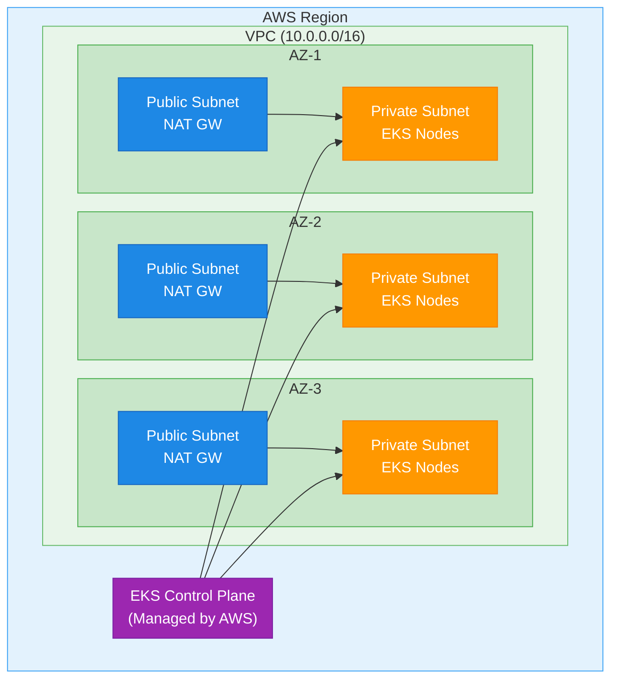

# AWS EKS Module for InferaDB

This Terraform module creates an AWS EKS cluster optimized for running InferaDB in production.

## Features

- **Production-Ready EKS Cluster**: Kubernetes 1.28+ with best practices
- **Multi-AZ Deployment**: High availability across 3 availability zones
- **Private Networking**: Worker nodes in private subnets with NAT gateways
- **IRSA Support**: IAM Roles for Service Accounts via OIDC provider
- **EBS CSI Driver**: Persistent volumes for stateful workloads
- **Security**: Encrypted secrets, VPC isolation, security groups
- **Observability**: Control plane logging enabled

## Usage

```hcl
module "eks" {
  source = "./modules/aws/eks"

  cluster_name       = "inferadb-prod"
  kubernetes_version = "1.28"

  # Networking
  vpc_cidr                 = "10.0.0.0/16"
  availability_zones_count = 3

  # Node Configuration
  node_instance_types = ["m5.xlarge"]
  node_desired_size   = 3
  node_min_size       = 3
  node_max_size       = 10

  # Security
  cluster_endpoint_public_access_cidrs = ["1.2.3.4/32"]  # Your IP

  tags = {
    Environment = "production"
    ManagedBy   = "terraform"
    Application = "inferadb"
  }
}
```

## Requirements

| Name       | Version |
| ---------- | ------- |
| terraform  | >= 1.5  |
| aws        | ~> 5.0  |
| kubernetes | ~> 2.23 |
| helm       | ~> 2.11 |

## Inputs

| Name                     | Description                  | Type           | Default         | Required |
| ------------------------ | ---------------------------- | -------------- | --------------- | :------: |
| cluster_name             | Name of the EKS cluster      | `string`       | n/a             |   yes    |
| kubernetes_version       | Kubernetes version           | `string`       | `"1.28"`        |    no    |
| vpc_cidr                 | CIDR block for VPC           | `string`       | `"10.0.0.0/16"` |    no    |
| availability_zones_count | Number of AZs                | `number`       | `3`             |    no    |
| node_instance_types      | EC2 instance types for nodes | `list(string)` | `["m5.xlarge"]` |    no    |
| node_desired_size        | Desired number of nodes      | `number`       | `3`             |    no    |
| node_min_size            | Minimum number of nodes      | `number`       | `3`             |    no    |
| node_max_size            | Maximum number of nodes      | `number`       | `10`            |    no    |
| enable_ebs_csi_driver    | Enable EBS CSI driver        | `bool`         | `true`          |    no    |
| tags                     | Tags to apply to resources   | `map(string)`  | `{}`            |    no    |

## Outputs

| Name                               | Description                  |
| ---------------------------------- | ---------------------------- |
| cluster_id                         | EKS cluster ID               |
| cluster_name                       | EKS cluster name             |
| cluster_endpoint                   | EKS API endpoint             |
| cluster_certificate_authority_data | CA certificate for kubectl   |
| oidc_provider_arn                  | OIDC provider ARN for IRSA   |
| vpc_id                             | VPC ID                       |
| private_subnet_ids                 | Private subnet IDs           |
| configure_kubectl                  | Command to configure kubectl |

## Post-Deployment

After the cluster is created:

1. **Configure kubectl**:

   ```bash
   aws eks update-kubeconfig --region <region> --name <cluster-name>
   ```

2. **Verify cluster**:

   ```bash
   kubectl get nodes
   kubectl get pods -A
   ```

3. **Deploy InferaDB**:

   ```bash
   helm install inferadb ./helm --namespace inferadb --create-namespace
   ```

## Architecture



## Security Considerations

1. **Network Isolation**: Worker nodes run in private subnets
2. **API Access**: Restrict public API access via CIDR allowlist
3. **Secrets Encryption**: EKS secrets encrypted with KMS
4. **IRSA**: Use IAM roles instead of static credentials
5. **Security Groups**: Minimal egress/ingress rules

## Cost Optimization

- **Right-size nodes**: Start with m5.xlarge, adjust based on load
- **Spot instances**: Consider spot instances for non-critical workloads
- **Autoscaling**: Use cluster autoscaler for dynamic scaling
- **Reserved instances**: For predictable production workloads

## Monitoring

The module enables EKS control plane logging for:

- API server logs
- Audit logs
- Authenticator logs
- Controller manager logs
- Scheduler logs

View logs in CloudWatch Logs under `/aws/eks/<cluster-name>/cluster/`.
